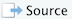
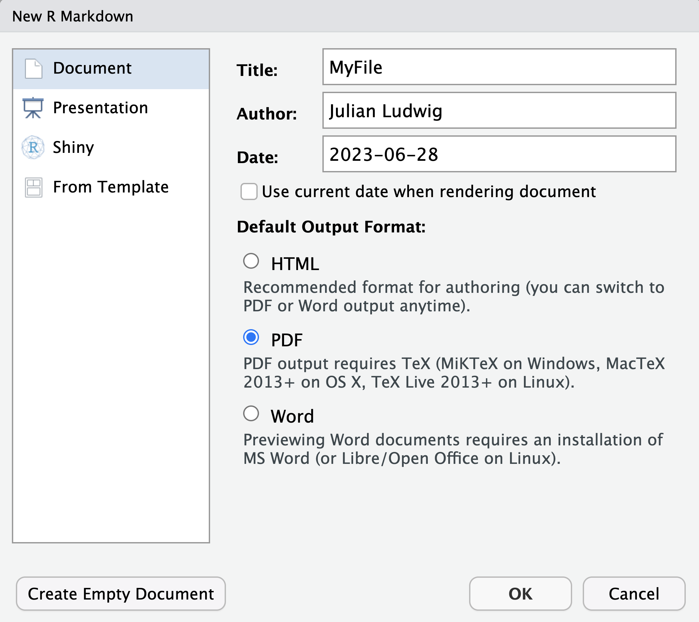
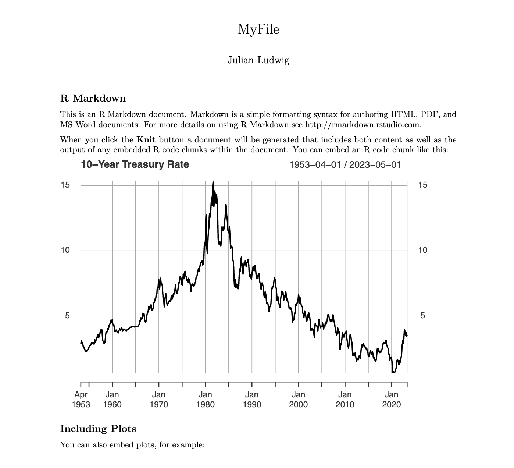
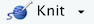

```{css, echo = FALSE, eval = FALSE}
body, td {
   font-size: 12px;
}
pre {
  font-size: 9px
}
code.r{
  font-size: 12px;
}


h1 {
  font-size: 28px;
}
h1.title {
  font-size: 38px;
}
h2 {
  font-size: 24px;
}
h3 {
  font-size: 18px;
}
h4 {
  font-size: 16px;
}
h5 {
  font-size: 12px;
}
h6 {
  font-size: 12px;
}
.table th:not([align]) {
  text-align: left;
}


#TOC {
  margin: 25px 0px 20px 0px;
}
@media (max-width: 768px) {
#TOC {
  position: relative;
  width: 100%;
}
}


.toc-content {
  padding-left: 30px;
  padding-right: 40px;
}

div.main-container {
  max-width: 1200px;
}

div.tocify {
  width: 20%;
  max-width: 260px;
  max-height: 85%;
}

@media (min-width: 768px) and (max-width: 991px) {
  div.tocify {
    width: 25%;
  }
}

@media (max-width: 767px) {
  div.tocify {
    width: 100%;
    max-width: none;
  }
}

.tocify ul, .tocify li {
  line-height: 7px;
}

.tocify-header .tocify-item {
  font-size: 7px;
  padding-left: 5px;
  text-indent: 0;
}

.tocify-subheader .tocify-item {
  font-size: 6px;
  padding-left: 10px;
  text-indent: 0;
}

.tocify .list-group-item {
  border-radius: 0px;
}
```


```{r setup, include=FALSE}
knitr::opts_chunk$set(fig.align = 'center', out.width = '80%', echo = TRUE, collapse = FALSE, warning = FALSE, message = FALSE, cache = FALSE, cache.path = "cache/")
```

```{r hidden, echo=FALSE}
# Quandl API key, which should only be used by me, Julian Ludwig
library("Quandl")
Quandl.api_key("CxtuMe8zyR_4qJgekZw5")

# Width of output printed in console
options(width = 80)
```


```{r, include=FALSE}
#========================================================================================
# Course Options
#========================================================================================
# User interface (ui):
ui <- list()
# Server
se <- list()

#++++++++++++++++++++++++++++++++
# General
#++++++++++++++++++++++++++++++++
ui$link$datacamp <- "https://www.datacamp.com/"


```


# Introduction {-}

This book is crafted with the vision to prepare students for careers in Economics and Finance. Professions in these fields require a firm grip on data interpretation and effective presentation techniques. Therefore, a substantial portion of this book is dedicated to fostering skills in data science and analytics. Readers are expected to invest considerable time in learning programming languages and producing data reports.

```{r foo, echo = FALSE}
```


Alongside these technical skills, this book delivers a comprehensive understanding of key macroeconomic indicators. It not only explores traditional indicators like GDP growth, inflation, money supply, and interest rates, but also ventures into survey- and text-based indicators. These encompass consumer confidence indices, forecaster data, real-time data, and text-based indicators of economic uncertainty. The latter are derived from the analysis of economic uncertainty-related language in newspapers, social media sites, or Google searches.

Engaging diligently with this book will equip students with the ability to conduct data analyses on diverse economic and financial topics. The assessment of learning outcomes will be determined based on the completion of DataCamp courses and the crafting of three data reports.

The book is organized into three modules:

- [*Module I: Introduction to R for Economic Research*]
- [*Module II: Traditional Economic Indicators*]
- [*Module III: Survey- and Text-Based Economic Indicators*]

Each module is designed to build upon the knowledge gained in the previous one, providing a thorough and comprehensive learning experience.


# *Module I: Introduction to R for Economic Research* {-} 

The first module provides an overview of freely accessible software widely used for data analysis in economic research. The central focus is R, a programming language specifically developed for statistical computing and graphics. Complementary software - RStudio, R Markdown, and LaTeX - are introduced as supportive tools for dynamic document creation based on R. This module will guide you through the installation process and will familiarize you with the utilization of these tools by exploring key syntax and its application to financial and economic data. Furthermore, the module discusses valuable resources such as [DataCamp](https://www.datacamp.com){target="_blank"}, an online learning platform, to enhance your expertise.


#### Module Overview {-}

This module consists of nine chapters:

- Chapter \@ref(software-overview): "Software Overview" provides an overview of software commonly used for data analysis in economic research.
- Chapter \@ref(software-installation): "Software Installation" gives instructions for the installation of these software tools.
- Chapter \@ref(rstudio-interface): "RStudio Interface" guides you through the interface of RStudio, a widely used IDE for R.
- Chapter \@ref(r-data-types-and-structures): "R Data Types and Structures" discusses the fundamental data types and structures in R.
- Chapter \@ref(importing-data-in-r): "Importing Data in R" explains how to import datasets into R for analysis.
- Chapter \@ref(downloading-data-in-r): "Downloading Data in R" instructs on how to download data directly within the R environment.
- Chapter \@ref(writing-reports-with-r-markdown): "Writing Reports with R Markdown" covers the use of R Markdown for creating dynamic, reproducible data reports.
- Chapter \@ref(learning-r-with-datacamp): "Learning R with DataCamp" introduces DataCamp as an essential online resource for learning R.
- Chapter \@ref(data-report-on-yield-curve): "Data Report on Yield Curve" provides an assessment to test the skills and knowledge gained throughout the module, centered around a data report on the yield curve.

In addition, the following [DataCamp](https://www.datacamp.com){target="_blank"} courses are integral to supplementing the content in Module I:

- [Introduction to R for Finance](https://app.datacamp.com/learn/courses/introduction-to-r-for-finance){target="_blank"}
- [Intermediate R for Finance](https://app.datacamp.com/learn/courses/intermediate-r-for-finance){target="_blank"}

Refer to Chapter \@ref(learning-r-with-datacamp) for guidelines on how to optimize your learning experience from these DataCamp courses.


#### Learning Objectives {-}

By the end of this module, you should be able to:

1. Identify the role and importance of software tools such as R, RStudio, R Markdown, and LaTeX in conducting economic research.
2. Install and set up necessary software including R, RStudio, R Markdown, and LaTeX for economic data analysis.
3. Navigate the RStudio interface, understanding its various panels and functionalities.
4. Understand and apply basic R data types and structures for data storage and manipulation.
5. Import external datasets into R for analysis, and download data directly within the R environment.
6. Create professional data reports using R Markdown, incorporating R code, text, plots, and tables seamlessly.
7. Utilize online learning resources like [DataCamp](https://www.datacamp.com){target="_blank"} to enhance R skills and knowledge further.
8. Apply the knowledge and skills acquired to write a detailed data report on yield curves, demonstrating proficiency in data import, manipulation, and presentation, as well as interpretation of economic data.


#### Learning Activities & Assessments for Module I {-}

Throughout this module, you'll participate in the following activities:

1. **Reading Material**: Read the nine chapters in Module I. Each chapter covers different topics, including the importance of specific software tools, the installation process for these tools, using RStudio, understanding R's data types and structures, importing and downloading data in R, creating reports with R Markdown, and learning R via online resources like [DataCamp](https://www.datacamp.com){target="_blank"}.

2. **Applying Reading Material**: Implement the knowledge you've gained from the chapters by replicating the steps outlined. This includes software installation, working with different data types, importing and downloading data, and visualizing results. To ensure understanding, I recommend copying any provided code into your RStudio environment and attempting to reproduce the same output.

3. **Online Learning with DataCamp**: Complete the DataCamp courses [Introduction to R for Finance](https://app.datacamp.com/learn/courses/introduction-to-r-for-finance){target="_blank"} and [Intermediate R for Finance](https://app.datacamp.com/learn/courses/intermediate-r-for-finance){target="_blank"}. These courses will bolster the concepts discussed in this module and introduce you to new data analysis techniques.

Your learning will be assessed based on the following:

1. **DataCamp Course Completion**: Completion of the designated DataCamp courses: [Introduction to R for Finance](https://app.datacamp.com/learn/courses/introduction-to-r-for-finance){target="_blank"} and [Intermediate R for Finance](https://app.datacamp.com/learn/courses/intermediate-r-for-finance){target="_blank"} is a necessity and part of your overall assessment.

2. **Data Report on Yield Curve**: Create a comprehensive data report on yield curves utilizing R Markdown. This report will act as a practical demonstration of your understanding of R, RStudio, and R Markdown. Your data report should showcase your proficiency in importing and manipulating data, visualizing the results, and delivering a sensible interpretation of yield curves. The quality of your report will form a significant part of your module assessment. For more details about this assignment, refer to Chapter \@ref(data-report-on-yield-curve).


Remember, mastery of R programming and data analysis is a step-by-step process. Make sure to thoroughly understand each data handling and manipulation technique before moving on to the next. If any challenges arise during your learning journey, do not hesitate to seek help. Good luck with your exploration of R!


# Software Overview

The following software and programming languages are commonly used for conducting economic analyses:

1. **R**: R is a programming language designed for statistical computing and graphics. This language is widely used by data scientists and researchers for a range of tasks such as data processing, visualization, model estimation, and performing predictive or causal inference. For instance, one can use R to import GDP data, plot the data, compute the GDP growth rate from this data, and finally, apply time-series modeling techniques to predict future GDP growth.

2. **LaTeX**: LaTeX is a powerful document preparation system widely used for typesetting scientific and technical documents. Similar to Microsoft Word, LaTeX is a text formatting software, but it offers advanced support for mathematical equations, cross-references, bibliographies, and more. LaTeX is particularly useful for creating professional-looking PDF documents with complex mathematical notation.

3. **Markdown**: Markdown is designed for simple and easy formatting of plain text documents. It uses plain text characters and a simple syntax to add formatting elements such as headings, lists, emphasis, links, images, and code blocks. Markdown allows for quick and readable content creation without the need for complex formatting options. It is often used for creating documentation, writing blog posts, and formatting text in online forums. Markdown documents can be easily converted to other formats, making it highly portable.

4. **R Markdown**: R Markdown combines R with Markdown, LaTeX, and Microsoft Word. This fusion creates an environment where data scientists and researchers can combine text and R code within the same document, eliminating the process of creating graphs in R and then transferring them to a Word or LaTeX document. An R Markdown document can be converted into several formats, including HTML, PDF, or Word. To generate a PDF, R Markdown initially crafts a LaTeX file which it then executes in the background. Thanks to the embedded R code in the R Markdown document, it's possible to automate data downloading and updating to ensure a financial report remains up-to-date. In fact, the text you're reading now was crafted with R Markdown.

5. **RStudio**: RStudio is an **Integrated Development Environment (IDE)** for R. An IDE is a software application that combines multiple programs into a single, user-friendly platform. Think of RStudio as the all-in-one tool you'll use for conducting economic research - it will handle all tasks, running R, Markdown, and LaTeX in the background for you. However, for RStudio to work, R, R Markdown, and a LaTeX processor must be installed on your computer, so that RStudio can use these programs in the background.

6. **R packages**: R provides a rich set of basic functions that can be extended with R packages. These packages are a collection of functions written by contributors for specific tasks. For example, the `quantmod` package provides functions for financial quantitative modeling.


All the software and programming languages mentioned above are **open-source**, meaning they are freely available and actively developed by a community of contributors. By mastering these tools, you will have the necessary skills to perform data analysis, create reproducible reports, and effectively communicate your findings in the field of economics.


# Software Installation

For data analysis, RStudio will serve as your environment for writing code and text. However, as an Integrated Development Environment (IDE), RStudio is not a standalone program; it depends on R, R Markdown, and a LaTeX processor installed on your system. RStudio interacts with these programs in the background to generate an output. Below, you will find the installation instructions for each of these programs. Additionally, a set of 18 steps is provided to help you verify whether R, RStudio, R Markdown, and LaTeX have been installed correctly.


## Install R

To install [`R`](https://www.r-project.org/){target="_blank"} on your computer, follow the instructions below:

#### For MacOS: {-}

1. To download [`R`](https://www.r-project.org/){target="_blank"} for MacOS, visit the R project website: [www.r-project.org](https://www.r-project.org/){target="_blank"}.
2. Click [CRAN mirror](https://cran.r-project.org/mirrors.html){target="_blank"} and choose your preferred mirror. It doesn't really matter which mirror you choose, simply choose a location close to you, e.g. [National Institute for Computational Sciences, Oak Ridge, TN](https://mirrors.nics.utk.edu/cran/){target="_blank"}.
3. Select [Download R for macOS](https://mirrors.nics.utk.edu/cran/){target="_blank"}.
4. Under "Latest release", read the first paragraph to check whether the program is compatible with your operating system (OS) and processor. To find your computer's OS and processor, click the top left Apple icon, and click "About this Mac." Under "macOS", you will see both the name (e.g. "Ventura", "Catalina", "Monterey") and the number (e.g. "Version 13.4.1") of the OS, and under "Processor" you will either see that your computer is run by an Intel processor or an Apple silicon (M1/M2) processor.
5. If the operating system (OS) and the processor are compatible, click on the first [`R-X.X.X.pkg`](https://mirrors.nics.utk.edu/cran/bin/macosx/big-sur-x86_64/base/R-4.3.1-x86_64.pkg){target="_blank"} (where `X` represents the R version numbers). Otherwise, if you have an older OS or an Intel processor, click on a version further down that is compatible with your system.
6. Once the file has downloaded, click it to proceed to installation, leaving all default settings as they are.


#### For Windows: {-}

1. To download [`R`](https://www.r-project.org/){target="_blank"} for Windows, visit the R project website: [www.r-project.org](https://www.r-project.org/){target="_blank"}.
2. Click [CRAN mirror](https://cran.r-project.org/mirrors.html){target="_blank"} and choose your preferred mirror. It doesn't really matter which mirror you choose, simply choose a location close to you, e.g. [Revolution Analytics, Dallas, TX](https://cran.microsoft.com/){target="_blank"}.
3. Select [Download R for Windows](https://cran.microsoft.com/bin/windows/){target="_blank"}.
4. Select "[base](https://cran.microsoft.com/bin/windows/base/){target="_blank"}", and read whether the program is compatible with your Windows version.
5. If it is compatible, click [Download `R-X.X.X` for Windows](https://cran.microsoft.com/bin/windows/base/){target="_blank"} (`X` are numbers), and otherwise click [here](https://support.microsoft.com/en-us/topic/update-for-universal-c-runtime-in-windows-c0514201-7fe6-95a3-b0a5-287930f3560c){target="_blank"} for older versions.
6. Once the file has downloaded, click it to proceed to installation, leaving all default settings as they are.


## Install RStudio

1. Visit the [`RStudio`](https://rstudio.com/){target="_blank"} website: [www.rstudio.com](https://www.rstudio.com/){target="_blank"} and navigate to the download page.
2. Click [DOWNLOAD](https://www.rstudio.com/products/rstudio/download/){target="_blank"}.
3. Scroll down to "All Installers" section.
4. Choose the download that matches your computer. If you have a Mac, it's most likely "macOS 10.15+"; then click the download link (e.g. "[RStudio-2022.07.1-554.dmg](https://www.rstudio.com/products/rstudio/download/#download){target="_blank"}"). If you have a Windows, it's most likely "Windows 10/11" and click the download link (e.g. "[RStudio-2022.07.1-554.exe](https://www.rstudio.com/products/rstudio/download/#download){target="_blank"}").
5. Open the file when it has downloaded, and install with the default settings.


## Install R Markdown

[`R Markdown`](https://rmarkdown.rstudio.com/){target="_blank"} can be installed from inside the [`RStudio`](https://rstudio.com/){target="_blank"} IDE.

1. To download [`R Markdown`](https://rmarkdown.rstudio.com/){target="_blank"}, open [`RStudio`](https://rstudio.com/){target="_blank"}, after you have successfully installed [`R`](https://www.r-project.org/){target="_blank"} and [`RStudio`](https://rstudio.com/){target="_blank"}.
2. In RStudio, find the "Console" window.
3. Type the command `install.packages("rmarkdown")` in the console and press Enter.


## Install LaTeX

When it comes to installing LaTeX, there are several software options available. While most options work well, I recommend using [`TinyTeX`](https://yihui.org/tinytex/){target="_blank"}. [`TinyTeX`](https://yihui.org/tinytex/){target="_blank"} as it is an easy-to-maintain LaTeX distribution. Other good alternatives include [`MacTeX`](https://www.tug.org/mactex/){target="_blank"} and [`MiKTeX`](https://miktex.org/){target="_blank"}. LaTeX is the underlying program responsible for word processing and generating PDF reports within RStudio.

To install [`TinyTeX`](https://yihui.org/tinytex/){target="_blank"} using [`RStudio`](https://rstudio.com/){target="_blank"}, follow these steps:

1. Open [`RStudio`](https://rstudio.com/){target="_blank"} after successfully installing [`R`](https://www.r-project.org/){target="_blank"}, [`RStudio`](https://rstudio.com/){target="_blank"}, and [`R Markdown`](https://rmarkdown.rstudio.com/){target="_blank"}.
2. Locate the "Console" window within RStudio.
3. Type `install.packages("tinytex")` and press Enter.
4. Type `tinytex::install_tinytex()` and press Enter.
5. Type `install.packages("knitr")` and press Enter.


## Install R Packages

R provides a set of basic functions that can be extended using packages. To install a package (e.g., `quantmod`), follow these steps:

1. Open RStudio.
2. In the RStudio window, find the "Console" window.
3. Type the command `install.packages("quantmod")` in the console and press Enter.
4. Wait for the installation process to complete. R will download and install the package from the appropriate repository.

After installation, you can use the package in your script by including the line `library("quantmod")` at the beginning. Remember to execute the `library("quantmod")` command each time you want to use functions from the `quantmod` package in your code. 

It is common practice to load the necessary packages at the beginning of your script, even if you don't use all of them immediately. This ensures that all the required functions and tools are available when needed and promotes a consistent and organized approach to package management in your code.

As a side note, the `quantmod` package includes the `getSymbols` function, which is commonly used to download financial data, such as the S&P 500 index ([GSPC](https://finance.yahoo.com/quote/%5EGSPC/){target="_blank"}):
```{r}
library("quantmod")
getSymbols(Symbols="^GSPC")
head(GSPC)
```

Here, the `getSymbols` function retrieves the historical data for the S&P 500 index from Yahoo Finance, and stores it in the `GSPC` object. The `head` function then displays the first few rows of the downloaded data.

R packages provide a wealth of specialized functions for specific tasks. To use a function from a particular package, you can indicate the package by preceding the function with the package name followed by a double colon `::`. For example, `quantmod::getSymbols()` specifies the `getSymbols()` function from the `quantmod` package. This practice helps to avoid conflicts when multiple packages provide functions with the same name. It also allows users to easily identify the package associated with the function, promoting clarity and reproducibility in code.


## 18-Step Test

To ensure that [`R`](https://www.r-project.org/){target="_blank"}, [`RStudio`](https://rstudio.com/){target="_blank"}, [`R Markdown`](https://rmarkdown.rstudio.com/){target="_blank"}, and [`LaTeX`](https://www.latex-project.org/){target="_blank"} are installed properly, you can follow the 18-step test provided below. This test will help verify the functionality of the installed programs and identify any potential issues or errors.

During this process, you may encounter the following issues:

- **Issue with Generating PDF**: If you are unable to generate a PDF file in step 15, it is likely due to an issue with the installation of [LaTeX](https://www.latex-project.org/). In such cases, please revisit the instructions for installing LaTeX in Chapter \@ref(install-latex) and ensure you have followed them correctly. Alternatively, you can consider installing [MacTeX](https://www.tug.org/mactex/) or [MiKTeX](https://miktex.org/) instead of [TinyTeX](https://yihui.org/tinytex/).

- **Non-Latin Alphabet Language**: If your computer language is not based on the Latin alphabet (e.g., Chinese, Arabic, Farsi, Russian, etc.), additional instructions may be required. You can refer to this video for specific guidance: [youtu.be/pX_fy2fyM30](https://youtu.be/pX_fy2fyM30).

I encourage you to persist and do your best to install all the required software, even if it takes some time. Downloading and installing programs is a critical skill that is essential in almost every profession today. This is an excellent opportunity to acquire this skill.

Keep going and don't hesitate to seek additional support or resources if needed. It's common to encounter challenges when installing software, and resources like [google.com](http://google.com){target="_blank"} and [stackoverflow.com](http://stackoverflow.com/questions/tagged/r){target="_blank"} can provide helpful answers and suggestions. If you encounter an error, simply copy and paste the error message into a search engine, and you'll likely find solutions and guidance from the community.

If you fail to install R, RStudio, and LaTeX, I recommend using [RStudio Cloud](https://rstudio.cloud/){target="_blank"}, an online platform where you can perform all the necessary tasks directly in your web browser. You can access RStudio Cloud at [rstudio.cloud](https://rstudio.cloud/){target="_blank"}. While signing up is free, please note that some features may require a fee.


#### Make a Plot {-}

To continue with the test, make sure you have [`R`](https://www.r-project.org/){target="_blank"}, [`RStudio`](https://rstudio.com/){target="_blank"}, [`R Markdown`](https://rmarkdown.rstudio.com/){target="_blank"}, and [`LaTeX`](https://www.latex-project.org/){target="_blank"} installed and are connected to the internet. Follow the steps below in RStudio:

  1. Type and execute `install.packages("quantmod")` in the RStudio console.
  2. Click on the top-left plus sign {target="_blank"} then click `R Script`.
  3. Click `File` - `Save As...` then choose a familiar folder.
  4. Copy and paste the following R code into your R Script:

```{r r-plot, fig.cap = "R Plot"}
library("quantmod")
treasury10y <- getSymbols(Symbols = "GS10", src = "FRED", auto.assign = FALSE)
plot(treasury10y, main = "10-Year Treasury Rate")
```
  
  5. Click on `Source`: {target="_blank"} (or use the shortcut Ctrl+Shift+Enter or Cmd+Shift+Return).

You should now see a plot of the 10-year Treasury rate on your screen. Compare it to the rate displayed on [fred.stlouisfed.org/series/GS10](https://fred.stlouisfed.org/series/GS10){target="_blank"}.


#### Save Plot as PDF {-}

Continue with the following steps in RStudio:

  6. Add the line: `pdf(file="myplot.pdf",width=6,height=4)` before the plot function, and add `dev.off()` after the plot:

```{r, results = 'hide'}
library("quantmod")
treasury10y <- getSymbols(Symbols = "GS10", src = "FRED", auto.assign = FALSE)
pdf(file = "myplot.pdf", width = 6, height = 4)
plot(treasury10y, main = "10-Year Treasury Rate")
dev.off()
```

  7. Click on `Source`: {target="_blank"} (or use the shortcut Ctrl+Shift+Enter or Cmd+Shift+Return).
  8. Now navigate to the same folder on your computer where you saved the R script.
  9. There should be a file called `myplot.pdf` - open it.

You should now see the PDF version of the plot displaying the Treasury rate. If you encounter no error message but cannot locate the `myplot.pdf` file, it's possible that R saved it in a different folder than where the R script is located. To check where R saves the plot, type `getwd()` in the console, which stands for "get working directory." If you want to change the working directory and have R save the files in a different folder, type `setwd("/Users/.../...")`, replacing `"/Users/.../..."` with the path to the desired folder.


#### Run Marked Code {-}

To run only one line or one variable, mark it and then click `Run`: {target="_blank"} (or use the shortcut Ctrl+Enter or Cmd+Return). Follow these steps in RStudio:

  10. Mark the variable `treasury10y`:
  
{width=70%}
  
  11. Click `Run`:  (or use shortcut Ctrl+Enter or Cmd+Return)

You should see the data displayed in your console, ending with `r end(treasury10y)` `r tail(treasury10y,1)`.


#### Create PDF with R Markdown {-}

Next, let's ensure that [`R Markdown`](https://rmarkdown.rstudio.com/){target="_blank"} is working. If you have installed [`LaTeX`](https://www.latex-project.org/){target="_blank"} and `knitr`, follow these steps in RStudio:

  12. Click on the top-left plus sign  then click `R Markdown...`
  13. A dialog box will appear - select `Document` and choose `PDF`, then click `OK`:

```{r new-rmarkdown, fig.cap = "New R Markdown", echo = FALSE}

```

You should now see a file with text and code.

  14. Click `File` - `Save As...` and choose a familiar folder to save the file.
  15. Click `Knit`:  (or use the shortcut Ctrl+Shift+K or Cmd+Shift+K).

A PDF file should appear on your screen and also in your chosen folder.
    
  16. Next, locate the following lines:

  ```{r,eval=FALSE}
  16 ```{r cars}
  17 summary(cars)
  18 ```
  ```

  17. Replace these lines with the following (do not copy the line numbers):

  ```{r,eval=FALSE}
  16 ```{r, message=FALSE,warning=FALSE,echo=FALSE}
  17 library("quantmod")
  18 treasury10y <- getSymbols(Symbols="GS10",src="FRED",auto.assign=FALSE)
  19 plot(treasury10y,main="10-Year Treasury Rate")
  20 ```
  ```

  18. Click `Knit`:  (or use the shortcut Ctrl+Shift+K or Cmd+Shift+K).

You should now see a file that looks similar to this:

```{r example-rmarkdown, fig.cap = "PDF File Produced with R Markdown", echo = FALSE}

```

Hint: You can set `echo=TRUE` to include R code in your report.

You can now change the title of the file and the text to create a professional report. If you click the arrow next to `Knit`:  you have options to export your file as an HTML or Word document instead of a PDF document, which is convenient when designing a website or writing an app:


#### Troubleshooting {-}

That's it! If everything worked as expected, you're good to go. If not, continue troubleshooting until it works.


# RStudio Interface

After launching RStudio on your computer, navigate to the menu bar and select "File," then choose "New File," and finally click on "R Script." Alternatively, you can use the keyboard shortcut Ctrl+Shift+N (Windows/Linux) or Cmd+Shift+N (Mac) to create a new R script directly.


## RStudio Sections

```{r rstudio-rscript-code, fig.cap = "RStudio Interface", echo = FALSE}
knitr::include_graphics("files/icons-rstudio/rstudio-rscript-code.png")
```

Once you have opened a new R script, you will notice that RStudio consists of four main sections:

1. **Source** (top-left): This section is where you write your R scripts. Also known as **do-files**, R scripts are files that contain a sequence of commands which can be executed either wholly or partially. To run a single line in your script, click on that line with your cursor and press the  button. However, to streamline your workflow, I recommend using the keyboard shortcut Ctrl+Enter (Windows/Linux) or Cmd+Enter (Mac) to run the line without reaching for the mouse. If you want to execute only a specific portion of a line, select that part and then press Ctrl+Enter or Cmd+Enter. To run all the commands in your R script, use the  button or the keyboard shortcut Ctrl+Shift+Enter (Windows/Linux) or Cmd+Shift+Enter (Mac).

2. **Console** (bottom-left): Located below the Source section, the Console is where R executes your commands. You can also directly type commands into the Console and see their output immediately. However, it is advisable to write commands in the R Script instead of the Console. By doing so, you can save the commands for future reference, enabling you to reproduce your results at a later time.

3. **Environment** (top-right): In the upper-right section, the Environment tab displays the current objects stored in memory, providing an overview of your variables, functions, and data frames. To create a variable, you can use the assignment operator `<-` (reversed arrow). Once a variable is created and assigned a numeric value, it can be utilized in arithmetic operations. For example:
```{r}
a <- 60
a + 20
```

4. **Files/Plots/Packages/Help/Viewer** (bottom-right): The bottom-right panel contains multiple tabs:
    - Files: displays your files and folders
    - Plots: displays your graphs
    - Packages: lets you manage your R packages
    - Help: provides help documentation
    - Viewer: lets you view local web content

These four main sections of RStudio provide a comprehensive environment for writing, executing, and managing your R code efficiently.


## R Scripts

An R script is a text file that contains your R code. You can execute parts of the script by selecting a subset of commands and pressing Ctrl+Enter or Cmd+Enter, or run the entire script by pressing Ctrl+Shift+Enter.

Any text written after a hashtag (`#`) in an R Script is considered comments and is not executed as code. Comments are valuable for providing explanations or annotations for your commands, enhancing the readability and comprehensibility of your code. 

```{r}
# This is a comment in an R script
x <- 10  # Assign the value 10 to x
y <- 20  # Assign the value 20 to y
z <- x + y  # Add x and y and assign the result to z
print(z)  # Print the value of z
```

The output displayed after two hashtags (`##`) in the example above: `## [1] `r z``, is not part of the actual R Script. Instead, it represents a line you would observe in your console when running the R Script. It showcases the result or value of the variable `z` in this case.

To facilitate working with lengthy R scripts, it is recommended to use a separate window. You can open a separate window by selecting  in the top-left corner.

```{r rstudio-rscript-separate, fig.cap = "RStudio Interface with Separate R Script Window", echo = FALSE}
knitr::include_graphics("files/icons-rstudio/rstudio-rscript-separate.png")
```

When the R Script is in a separate window, you can easily switch between the R Script window and the Console/Environment/Plot Window by pressing Ctrl+Tab or Cmd+Tab. This allows for convenient navigation between different RStudio windows.


# R Data Types and Structures

The R language supports a broad array of operations such as mathematical calculations, logical analyses, and text manipulation. However, the applicability of a function to a variable depends on the variable's data type. For instance, an arithmetic function to add two variables won't work if the variables store text.

R supports various data types, including numeric (`x <- 15`), character (`x <- "Hello!"`), and logical (`x <- TRUE` or `x <- FALSE`). In addition to single values (scalars), R allows variables to hold collections of numbers or strings using vectors, matrices, lists, or data frames. Advanced data structures such as tibbles, data tables, and `xts` objects provide additional features beyond traditional data frames.

In this chapter, we will explore the following data types:

1. **Scalar**: A single data element, such as a number or a character string.
2. **Vector**: A one-dimensional array that contains elements of the same type.
3. **Matrix** (`matrix`): A two-dimensional array with elements of the same type.
4. **List** (`list`): A one-dimensional array capable of storing various data types.
5. **Data Frame** (`data.frame`): A two-dimensional array that can accommodate columns of different types.
6. **Tibble** (`tbl_df`): An enhanced version of data frames, offering user-friendly features.
7. **Data Table** (`data.table`): An optimized data frame extension designed for speed and handling large datasets.
8. **Extensible Time Series** (`xts`): A time-indexed data frame specifically designed for time series data.

Understanding the data type of variables is crucial because it determines the operations and functions that can be applied to them.

It's worth noting that R provides so-called **wrapper functions**, which are functions that have the same name but perform different actions depending on the data object. These wrapper functions adapt their behavior based on the input data type, allowing for more flexible and intuitive programming. For example, the `summary()` function in R is a wrapper function. When applied to a numeric vector, it provides statistical summaries such as mean, median, and quartiles. However, when applied to a data frame, it gives a summary of each variable, including the minimum, maximum, and quartiles for numerical variables, as well as counts and levels for categorical variables.


## Scalar

Scalars in R are variables holding single objects. You can determine an object's type by applying the `class()` function to the variable.


#### Numbers, Characters, and Logical Values {-}

```{r, results = "hold"}
# Numeric (a.k.a. Double)
w <- 5.5  # w is a decimal number.
class(w)  # Returns "numeric".

# Integer
x <- 10L  # The L tells R to store x as an integer instead of a decimal number.
class(x)  # Returns "integer".

# Complex
u <- 3 + 4i # u is a complex number, where 3 is real and 4 is imaginary.
class(u)  # Returns "complex".

# Character
y <- "Hello, World!"  # y is a character string.
class(y)  # Returns "character".

# Logical
z <- TRUE  # z is a logical value.
class(z)  # Returns "logical".
```

An object's type dictates which functions can be applied. For example, mathematical functions are applicable to numbers but not characters:

```{r, results = "hold"}
# Mathematical operations
2 + 2  # Results in 4.
3 * 5  # Results in 15.
(1 + 2) * 3  # Results in 9 (parentheses take precedence).

# Logical operations
TRUE & FALSE  # Results in FALSE (logical AND).
TRUE | FALSE  # Results in TRUE (logical OR).

# String operations
paste("Hello", "World!")  # Concatenates strings, results in "Hello World!".
nchar("Hello")  # Counts characters in a string, results in 5.
```


#### Dates and Times {-}

When conducting economic research, it is common to deal with data types specifically designed for storing date and time information:

```{r}
# Date
v <- as.Date("2023-06-30")  # v is a Date.
# The default input format is %Y-%m-%d, where
# - %Y is year in 4 digits,
# - %m is month with 2 digits, and 
# - %d is day with 2 digits.
class(v)  # Returns "Date".

# POSIXct (Time)
t <- as.POSIXct("2023-06-30 18:47:10", tz = "CDT")  # t is a POSIXct.
# The default input format is %Y-%m-%d %H:%M:%S, where
# - %H is hour out of 24,
# - %M is minute out of 60, and
# - %S is second out of 60.
# The tz input is the time zone, where CDT = Central Daylight Time.
class(t)  # Returns "POSIXct".
```

The default input format, `%Y-%m-%d` or `%Y-%m-%d %H:%M:%S`, can be changed by specifying a format input. The output format can be adjusted by applying the `format()` function to the object:

```{r}
# Date with custom input format:
v <- as.Date("April 6 -- 23", format = "%B %d -- %y")
v  # Returns default output format: %Y-%m-%d.
format(v, format = "%B %d, %Y")  # Returns a custom output format: "%B %d, %Y".
```

The syntax for different date formats can be found by typing `?strptime` in the R console. Some of the most commonly used formats are outlined in the table below:


```{r, echo = FALSE, results = 'asis'}
library("kableExtra")
date_table <- read.csv("files/date_formats.csv")
date_table[is.na(date_table)] <- ""
kable(date_table, booktabs = TRUE, 
      caption = "Syntax for Date Format") %>% 
    kable_styling("striped", 
                  position = "center", full_width = FALSE) %>% 
    row_spec(1:nrow(date_table), font_size = 8)
```


Here are some example operations for `Date` objects:

```{r}
# Date Operations
date1 <- as.Date("2023-06-30")
date2 <- as.Date("2023-01-01")

# Subtract dates to get the number of days between
days_between <- date1 - date2
days_between

# Add days to a date
date_in_future <- date1 + 30
date_in_future
```


## Vector

In R, a vector is a homogeneous sequence of elements, meaning they must all be of the same basic type. As such, a vector can hold multiple numbers, but it cannot mix types, such as having both numbers and words. The function `c()` (for combine) can be used to create a vector:

```{r, results = "hold"}
# Numeric vector
numeric_vector <- c(1, 2, 3, 4, 5)
class(numeric_vector)  # Returns "numeric".

# Character vector
character_vector <- c("Hello", "World", "!")
class(character_vector)  # Returns "character".

# Logical vector
logical_vector <- c(TRUE, FALSE, TRUE)
class(logical_vector)  # Returns "logical".
```


The function `c()` can also be used to add elements to a vector:

```{r}
# Add elements to existing vector:
x <- c(1, 2, 3)
x <- c(x, 4, 5, 6)
x
```

The `sec()` function creates a sequence of numbers or dates:

```{r}
# Create a sequence of numbers:
x <- seq(from = 1, to = 1.5, by = 0.1)
x

# Create a sequence of dates:
x <- seq(from = as.Date("2004-05-01"), to = as.Date("2004-12-01"), by = "month")
x
```

Missing data is represented as `NA` (not available). The function `is.na()` indicates the elements that are missing and `anyNA()` returns TRUE if the vector contains any missing values:

```{r}
x <- c(1, 2, NA, NA, 4, 9, 12, 5, 4, NA)
is.na(x)
anyNA(x)
```


A generalization of logical vectors are **factors**, which are vectors that restrict entries to be one of predefined categories:

```{r}
# Unordered factors, e.g. categories "Male" and "Female":
gender_vector <- c("Male", "Female", "Male", "Male", "Male", "Female", "Male")
factor_gender_vector <- factor(gender_vector)
factor_gender_vector

# Ordered factors, e.g. categories with ordering Low < Medium < High:
temperature_vector <- c("High", "Low", "Low", "Low", "Medium", "Low", "Low")
factor_temperature_vector <- factor(temperature_vector, 
                                    order = TRUE, 
                                    levels = c("Low", "Medium", "High"))
factor_temperature_vector
```


## Matrix (`matrix`)

A matrix in R (`matrix`) is a two-dimensional array that extends atomic vectors, containing both rows and columns. The elements within a matrix must be of the same data type.

```{r}
# Create a 3x3 numeric matrix, column-wise:
numeric_matrix <- matrix(1:9, nrow = 3, ncol = 3)
numeric_matrix
class(numeric_matrix)  # Returns "matrix".
typeof(numeric_matrix)  # Returns "numeric".

# Create a 2x3 character matrix, row-wise:
character_matrix <- matrix(letters[1:6], nrow = 2, ncol = 3, byrow = TRUE)
character_matrix
class(character_matrix)  # Returns "matrix".
typeof(character_matrix)  # Returns "character".
```

To select specific elements, rows, or columns within a matrix, square brackets are used. The `cbind()` and `rbind()` functions enable the combination of columns and rows, respectively.

```{r}
# Print element in the second row and first column:
character_matrix[2, 1]

# Print the second row:
character_matrix[2, ]

# Combine matrices:
x <- matrix(1:4, nrow = 2, ncol = 2)
y <- matrix(101:104, nrow = 2, ncol = 2)
rbind(x, y)  # Combines matrices x and y row-wise.
cbind(x, y)  # Combines matrices x and y column-wise.
```


## List (`list`)

A list (`list`) in R serve as an ordered collection of objects. In contrast to vectors, elements within a list are not required to be of the same type. Moreover, some list elements may store multiple sub-elements, allowing for complex nested structures. For instance, a single element of a list might itself be a matrix or another list.

```{r}
# List
my_list <- list(1, "a", TRUE, 1+4i, 
                c(1, 2, 3), matrix(1:8, 2, 4), list("c",4))
names(my_list) <- c("num_1", "char_a", "log_T", "complex_1p4i",
                    "vec", "mat", "list")
my_list
class(my_list)  # Returns "list".
```

The content of elements can be retrieved by using double square brackets:

```{r}
# Select second element:
my_list[[2]]

# Select element named "mat":
my_list[["mat"]]
```


## Data Frame (`data.frame`)

A data frame (`data.frame`) in R resembles a matrix in its two-dimensional, rectangular structure. However, unlike a matrix, a data frame allows each column to contain a different data type. Therefore, within each column (or vector), the elements must be homogeneous, but different columns can accommodate distinct types. Typically, when importing data into R, the default object type used is a data frame.

```{r}
# Vectors
student_names <- c("Anna", "Ella", "Sophia")
student_ages <- c(23, 21, 25)
student_grades <- c("A", "B", "A")
student_major <- c("Math", "Biology", "Physics")

# Data frame
students_df <- data.frame(name = student_names, 
                          age = student_ages, 
                          grade = student_grades, 
                          major = student_major)
students_df
class(students_df)  # Returns "data.frame".
```

Data frames are frequently used for data storage and manipulation in R. The following illustrates some common functions used on data frames:

```{r, results = "hold"}
# Access a column in the data frame
students_df$name

# Alternative way to access a column:
students_df[["name"]]

# Access second row in third column:
students_df[2, 3]
```

```{r, results = "hold"}
# When selecting just one column, data frame produces a vector
class(students_df[, 3])

# To avoid this, add drop = FALSE
class(students_df[, 3 , drop = FALSE])
```

```{r}
# Add a column to the data frame
students_df$gpa <- c(3.8, 3.5, 3.9)
students_df

# Subset the data frame
students_df[students_df$age > 22 & students_df$gpa > 3.6, ]
```

```{r, results = "hold"}
# Number of columns and rows
ncol(students_df)
nrow(students_df)

# Column and row names
colnames(students_df)
rownames(students_df)
```

```{r}
# Change column names
colnames(students_df) <- c("Name", "Age", "Grade", "Major", "GPA")
students_df

# Take a look at the data type of each column
str(students_df)
```

```{r, eval = FALSE}
# Take a look at the data in a separate window
View(students_df)
```


These examples illustrate just a few of the operations you can perform with data frames in R. With additional libraries like `dplyr`, `tidyr`, and `data.table`, more complex manipulations are possible.


## Tibble (`tbl_df`) {#tibble}

A tibble (`tbl_df`) is a more convenient version of a data frame. It is part of the `tibble` package in the `tidyverse` collection of R packages. To use tibbles, you need to install the `tibble` package by executing `install.packages("tibble")` in your console. Don't forget to include `library("tibble")` at the beginning of your R script.

To create a tibble, you can use the `tibble()` function. Here's an example:

```{r}
# Load R package
library("tibble")

# Create a new tibble
tib <- tibble(name = letters[1:3], 
              id = sample(1:5, 3),
              age = sample(18:70, 3),
              sex = factor(c("M", "F", "F")))
tib
class(tib)
```

One advantage of tibbles is that they make it easy to calculate and create new columns. Here's an example:

```{r}
tib <- tibble(tib, idvage = id/age)
tib
```

Unlike regular data frames, tibbles allow non-standard column names. You can use special characters or numbers as column names. Here's an example:

```{r}
tibble(`:)` = "smile", ` ` = "space", `2000` = "number")
```

Another way to create a tibble is with the `tribble()` function. It allows you to define column headings using formulas starting with ~ and separate entries with commas. Here's an example:

```{r}
tribble(
    ~x, ~y, ~z,
    "a", 2, 3.6,
    "b", 1, 8.5
)
```

For additional functions and a helpful cheat sheet on `tibble` and `dplyr`, you can refer to this [cheat sheet](https://github.com/rstudio/cheatsheets/raw/master/data-transformation.pdf).


#### Tidyverse {-}

The `tibble` package is part of the `tidyverse` environment, which is a collection of R packages with a shared design philosophy, grammar, and data structures. To install `tidyverse`, execute `install.packages("tidyverse")`, which includes `tibble`, `readr`, `dplyr`, `tidyr`, `ggplot2`, and more. Key functions in the `tidyverse` include `select()`, `filter()`, `mutate()`, `arrange()`, `count()`, `group_by()`, and `summarize()`. An interesting operator in the `tidyverse` is the [pipe operator](https://www.datacamp.com/community/tutorials/pipe-r-tutorial) `%>%`,  which allows you to chain functions together in a readable and sequential manner. With the pipe operator, you can order the functions as they are applied, making your code more expressive and easier to understand. Here's an example:

```{r}
library("tidyverse")
x <- c(0.109, 0.359, 0.63, 0.996, 0.515, 0.142, 0.017, 0.829, 0.907)

# Apply several functions to x:
y <- round(exp(diff(log(x))), 1)
y

# Perform the same computations using pipe operators:
y <- x %>% log() %>% diff() %>% exp() %>% round(1)
y
```

By using the `%>%` operator, each function is applied to the previous result, simplifying the code and improving its readability.

To delve deeper into the tidyverse, explore their official website: [www.tidyverse.org](https://www.tidyverse.org). Another resource is the R-Bootcamp, available at [r-bootcamp.netlify.app](https://r-bootcamp.netlify.app/). Additionally, [DataCamp](https://learn.datacamp.com/) provides a comprehensive skill track devoted to the tidyverse, named [Tidyverse Fundamentals with R](https://learn.datacamp.com/skill-tracks/tidyverse-fundamentals).


## Data Table (`data.table`)

A data table (`data.table`) is similar to a data frame but with more advanced features for data manipulation. In fact, `data.table` and `tibble` can be considered competitors, with each offering enhancements over the standard data frame. While data tables offer high-speed functions and are optimized for large datasets, tibbles from the `tidyverse` are slower but are more user-friendly. The syntax used in `data.table` functions may seem esoteric, differing from that used in `tidyverse`. Like tibble, `data.table` is not a part of base R. It requires the installation of the `data.table` package via `install.packages("data.table")`, followed by `library("data.table")` at the beginning of your script.

To create a data table, you can use the `data.table()` function. Here's an example:

```{r}
# Load R package
library("data.table")

# Create a new data.table:
dt <- data.table(name = letters[1:3], 
                 id = sample(1:5,3),
                 age = sample(18:70,3), 
                 sex = factor(c("M", "F", "F")))
dt
class(dt)
```

Columns in a data table can be referenced directly, and new variables can be created using the `:=` operator:

```{r}
# Selection with data frame vs. data table:
df <- as.data.frame(dt) # create a data frame for comparison
df[df$sex == "M", ] # select with data frame
dt[sex == "M", ] # select with data table

# Variable assignment with data frame vs. data table:
df$id_over_age <- df$id / df$age # assign with data frame
dt[, id_over_age := id / age] # assign with data table
```

You can select multiple variables with a list:

```{r}
dt[, list(sex, age)]
```

Multiple variables can be assigned simultaneously, where the LHS of the `:=` operator is a character vector of new variable names, and the RHS is a list of operations:

```{r}
dt[, c("id_times_age", "id_plus_age") := list(id * age, id + age)]
dt
```

Many operations in data analysis need to be done by group (e.g. calculating average unemployment by year). In such cases, data table introduces a third dimension to perform these operations. Specifically, the data table syntax is `DT[i,j,by]` with options to

* subset rows using `i` (which rows?),
* manipulate columns with `j` (what to do?), and
* group according to `by` (grouped by what?).

Here is an example:

```{r}
# Produce table with average age by sex:
dt[, mean(age), by = sex]

# Do the same but name the columns "Gender" and "Age by Gender":
dt[, list(`Age by Gender` = mean(age)), by = list(Gender = sex)]

# Assign a new variable with average age by sex named "age_by_sex":
dt[, age_by_sex := mean(age), by = sex]
dt
```

For additional information about data tables and their powerful features, check out the [Intro to Data Table](https://cran.r-project.org/web/packages/data.table/vignettes/datatable-intro.html) documentation and this [cheat sheet](https://s3.amazonaws.com/assets.datacamp.com/blog_assets/datatable_Cheat_Sheet_R.pdf) for `data.table` functions. Furthermore, [DataCamp](https://learn.datacamp.com/) provides several courses on `data.table`, such as:

* [Data Manipulation with data.table in R](https://learn.datacamp.com/courses/data-manipulation-with-datatable-in-r)
* [Joining Data with data.table in R](https://learn.datacamp.com/courses/joining-data-with-datatable-in-r)
* [Time Series with data.table in R](https://learn.datacamp.com/courses/time-series-with-datatable-in-r)


## Extensible Time Series (`xts`) {#xts}

`xts` (e**x**tensible **t**ime **s**eries)  objects are specialized data structures designed for time series data. These are datasets where each observation corresponds to a specific timestamp. `xts` objects attach an index to the data, aligning each data point with its associated time. This functionality simplifies data manipulation and minimizes potential errors:

```{r matrix-with-index, fig.cap = "Data with Index. *Source*: [DataCamp](https://learn.datacamp.com/courses/manipulating-time-series-data-with-xts-and-zoo-in-r).", echo = FALSE}

```

The index attached to an `xts` object is usually a `Date` or `POSIXct` vector, maintaining the data in chronological order from earliest to latest. If you wish to sort data (such as stock prices) by another variable (like trade volume), you'll first need to convert the `xts` object back to a data frame, as `xts` objects preserve the time order. `xts` objects are built upon `zoo` objects (Zeileis' Ordered Observations), another class of time-indexed data structures. `xts` objects enhance these base structures by providing additional features.

Like `tibble` and `data.table`, `xts` is not included in base R. To use it, you need to install the `xts` package using `install.packages("xts")`, then include `library("xts")` at the start of your script.

To create an `xts` object, use the `xts()` function which associates data with a time index (`order.by = time_index`):

```{r}
# Load R package
library("xts")

# Create a new xts object from a matrix:
data <- matrix(1:4, ncol = 2, nrow = 2, dimnames = list(NULL, c("a", "b")))
data
time_index <- as.Date(c("2020-06-01", "2020-07-01"))
time_index
dxts <- xts(x = data, order.by = time_index)
dxts
class(dxts)
tclass(dxts)

# Extract time index
index(dxts)

# Extract data without time index
coredata(dxts)
```

To delve deeper into `xts` and `zoo` objects, consider reading the guides [Manipulating Time Series Data in R with xts & zoo](https://rstudio-pubs-static.s3.amazonaws.com/288218_117e183e74964557a5da4fc5902fc671.html) and [Time Series in R: Quick Reference](https://rpubs.com/rmariscal/404513). Additionally, [DataCamp](https://learn.datacamp.com/) provides in-depth courses on these topics: 

* [Manipulating Time Series Data with xts and zoo in R](https://learn.datacamp.com/courses/manipulating-time-series-data-with-xts-and-zoo-in-r)
* [Importing and Managing Financial Data in R](https://learn.datacamp.com/courses/importing-and-managing-financial-data-in-r)

If you're working within the `tidyverse` environment, the R package [`tidyquant`](http://www.stats.bris.ac.uk/R/web/packages/tidyquant/vignettes/TQ02-quant-integrations-in-tidyquant.html) offers seamless integration with `xts` and `zoo`. Lastly, this handy [cheat sheet](https://s3.amazonaws.com/assets.datacamp.com/blog_assets/xts_Cheat_Sheet_R.pdf) provides a quick reference on `xts` and `zoo` functions.


# Importing Data in R

R is a software specialized for data analysis. To analyze data using R, the data must first be imported into the R environment. R offers robust functionality for importing data in a variety of formats. This chapter explores how to import data from CSV, TSV, and Excel files. Before we dive into specifics, let's ensure RStudio can locate the data stored on your computer.


## Working Directory

The working directory in R is the folder where R starts when it's looking for files to read or write. If you're not sure where your current working directory is, you can use the `getwd()` (get working directory) command in R to find out: 
```{r}
getwd()
```

To change your working directory, use the `setwd()` (set working directory) function:

```{r, eval = FALSE}
setwd("your/folder/path")
```

Be sure to replace `"your/folder/path"` with the actual path to your folder.

When your files are stored in the same directory as your working directory, defined using the `setwd()` function, you can directly access these files by their names. For instance, `read_csv("yieldcurve.csv")` will successfully read the file if "yieldcurve.csv" is in the working directory. If the file is located in a subfolder within the working directory, for example a folder named `files`, you would need to specify the folder in the file path when calling the file: `read_csv("files/yieldcurve.csv")`.

To find out the folder path for a specific file or folder on your computer, you can follow these steps:

#### For Windows: {-}

1. Navigate to the folder using the File Explorer.
2. Once you are in the folder, click on the address bar at the top of the File Explorer window. The address bar will now show the full path to the folder. This is the path you can set in R using the `setwd()` function.

An example of a folder path on Windows might look like this: `C:/Users/YourName/Documents/R`.

#### For MacOS: {-}

1. Open Finder and navigate to the folder.
2. Once you are in the folder, Command-click (or right-click and hold, if you have a mouse) on the folder's name at the top of the Finder window. A drop-down menu will appear showing the folder hierarchy.
3. Hover over each folder in the hierarchy to show the full path, then copy this path.

An example of a folder path on macOS might look like this: `/Users/YourName/Documents/R`.

Remember, when setting the working directory in R, you need to use forward slashes (`/`) in the folder path, even on Windows where the convention is to use backslashes (`\`).


## Yield Curve

In this chapter, we'll demonstrate how to import a CSV file using real-world Treasury yield curve rates data.

To obtain the yield curve data, follow these steps:

1. Visit the U.S. Treasury's data center by clicking [here](https://www.treasury.gov/resource-center/data-chart-center).
2. Click on "Data" in the menu bar, then select "Daily Treasury Par Yield Curve Rates."
3. On the data page, select "Download CSV" to obtain the yield curve data for the current year.
4. To access all the yield curve data since 1990, choose "All" under the "Select Time Period" option, and click "Apply." Please note that when selecting all periods, the "Download CSV" button may not be available.
5. To manually save the data as a CSV file, you can copy the data by selecting it and using the Ctrl+C (or Cmd+C) command. Open an Excel file, and use the Ctrl+V (or Cmd+V) command to paste the data into the Excel file.
6. Save the Excel file as a CSV file named 'yieldcurve.csv' in a location of your choice, ensuring that it is saved in a familiar folder for easy access.


### Import CSV File

CSV (Comma Separated Values) is a common file format used to store tabular data. As the name suggests, the values in each row of a CSV file are separated by commas. Here's an example of how data is stored in a CSV file:

* Male,8,100,3
* Female,9,20,3

To import the 'yieldcurve.csv' CSV file in R, install and load the `readr` package. Run `install.packages("readr")` in the console and include the package at the top of your R script. You can then use the `read_csv()` or `read_delim()` function to import the yield curve data:

```{r}
# Load the package
library("readr")

# Import CSV file
yc <- read_csv(file = "files/yieldcurve.csv", col_names = TRUE)

# Import CSV file using the read_delim() function
yc <- read_delim(file = "files/yieldcurve.csv", col_names = TRUE, delim = ",")
```

In the code snippets above, the `read_csv()` and `read_delim()` functions from the `readr` package are used to import a CSV file named "yieldcurve.csv". The `col_names = TRUE` argument indicates that the first row of the CSV file contains column names. The `delim = ","` argument specifies that the columns are separated by commas, which is the standard delimiter for CSV (*Comma* Separated Values) files. Either one of the two functions can be used to read the CSV file and store the data in the variable `yc` for further analysis.

To inspect the first few rows of the data, print the `yc` object in the console. For an overview of the entire dataset, use the `View()` function, which provides an interface similar to viewing the CSV file in Microsoft Excel:

```{r}
# Display the data
yc
```
```{r, eval = FALSE}
# Display the data in a spreadsheet-like format
View(yc)
```

Both the `read_csv()` and `read_delim()` functions convert the CSV file into a tibble (`tbl_df`), a modern version of the R data frame discussed in Chapter \@ref(tibble). Remember, a data frame stores data in separate columns, each of which must be of the same data type. Use the `class(yc)` function to check the data type of the entire dataset, and `sapply(yc, class)` to check the data type of each column:

```{r}
# Check the data type of the entire dataset
class(yc)

# Check the data type of each column
sapply(yc, class)
```


When importing data in R, it's possible that R assigns incorrect data types to some columns. For example, the `Date` column is treated as a character column even though it contains dates, and the `30 Yr` column is treated as a character column even though it contains interest rates. To address this issue, you can convert the first column to a date type and the remaining columns to numeric data types using the following three steps:

1. Replace "N/A" with `NA`, which represents missing values in R. This step is necessary because R doesn't recognize "N/A", and if a column includes "N/A", R will consider it as a character vector instead of a numeric vector.

```{r}
yc[yc == "N/A"] <- NA
```

2. Convert all yield columns to numeric data types:

```{r}
yc[, -1] <- sapply(yc[, -1], as.numeric)
```

The `as.numeric()` function converts a data object into a numeric type. In this case, it converts columns with character values like "3" and "4" into the numeric values 3 and 4. The `sapply()` function applies the `as.numeric()` function to each of the selected columns. This converts all the interest rates to numeric data types.

3. Convert the date column to a date object, recognizing that the date format is Month/Day/Year or `%m/%d/%Y`:

```{r}
# Check the date format
head(yc$Date)

# Convert to date format
yc$Date <- as.Date(yc$Date, format = "%m/%d/%Y")
head(yc$Date)
```


Hence, we have successfully imported the yield curve data and performed the necessary conversions to ensure that all columns are in their correct formats:

```{r}
yc
```

Here, `<dbl>` stands for double, which is the R data type for decimal numbers, also known as numeric type. Converting the yield columns to `dbl` ensures that the values are treated as numeric and can be used for calculations, analysis, and visualization.


### Plotting Historical Yields

Let's use the `plot()` function to visualize the imported yield curve data. In this case, we will plot the 3-month Treasury rate over time, using the `Date` column as the x-axis and the `3 Mo` column as the y-axis:

```{r yield-historical-plot-code, eval = FALSE}
# Plot the 3-month Treasury rate over time
plot(x = yc$Date, y = yc$`3 Mo`, type = "l",
     xlab = "Date", ylab = "%", main = "3-Month Treasury Rate")
```

In the code snippet above, `plot()` is the R function used to create the plot. It takes several arguments to customize the appearance and behavior of the plot:

- `x` represents the data to be plotted on the x-axis. In this case, it corresponds to the `Date` column from the yield curve data.
- `y` represents the data to be plotted on the y-axis. Here, it corresponds to the `3 Mo` column, which represents the 3-month Treasury rate.
- `type = "l"` specifies the type of plot to create. In this case, we use `"l"` to create a line plot.
- `xlab = "Date"` sets the label for the x-axis to "Date".
- `ylab = "%"` sets the label for the y-axis to "%".
- `main = "3-Month Treasury Rate"` sets the title of the plot to "3-Month Treasury Rate".


```{r yield-historical-plot, ref.label = "yield-historical-plot-code", fig.cap = "3-Month Treasury Rate", echo = FALSE}
```


The resulting plot, shown in Figure \@ref(fig:yield-historical-plot), displays the historical evolution of the 3-month Treasury rate since 1990. It allows us to observe how interest rates have changed over time, with low rates often observed during recessions and high rates during boom periods. Recessions are typically characterized by reduced borrowing and investment activities, leading to decreased demand for credit and lower interest rates. Conversely, boom periods are associated with strong economic growth and increased credit demand, which can drive interest rates upward.

Furthermore, inflation plays a significant role in influencing interest rates through the Fisher effect. When inflation is high, lenders and investors are concerned about the diminishing value of money over time. To compensate for the erosion of purchasing power, lenders typically demand higher interest rates on loans. These higher interest rates reflect the expectation of future inflation and act as a safeguard against the declining value of the money lent. Conversely, when inflation is low, lenders may offer lower interest rates due to reduced concerns about the erosion of purchasing power.


### Plotting Yield Curve

Next, let's plot the yield curve. The yield curve is a graphical representation of the relationship between the interest rates (yields) and the time to maturity of a bond. It provides insights into market expectations regarding future interest rates and economic conditions.

To plot the yield curve, we will select the most recently available data from the dataset, which corresponds to the last row. We will extract the interest rates as a numeric vector and the column names (representing the time to maturity) as labels for the x-axis:

```{r}
# Extract the interest rates of the last row
yc_most_recent_data <- as.numeric(last(yc[, -1]))
yc_most_recent_data

# Extract the column names of the last row
yc_most_recent_labels <- colnames(last(yc[, -1]))
yc_most_recent_labels
```

```{r yield-curve-plot-code, eval = FALSE}
# Plot the yield curve
plot(x = yc_most_recent_data, xaxt = 'n', type = "o", pch = 19,
     xlab = "Time to Maturity", ylab = "Treasury Rate in %",
     main = paste("Yield Curve on", format(last(yc$Date), format = '%B %d, %Y')))
axis(side = 1, at = seq(1, length(yc_most_recent_labels), 1), 
     labels = yc_most_recent_labels)
```

In the code snippet above, `plot()` is the R function used to create the yield curve plot. Here are the key inputs and arguments used in the function:

- `x = yc_most_recent_data` represents the interest rates of the most recent yield curve data, which will be plotted on the x-axis.
- `xaxt = 'n'` specifies that no x-axis tick labels should be displayed initially. This is useful because we will customize the x-axis tick labels separately using the `axis()` function.
- `type = "o"` specifies that the plot should be created as a line plot with points. This will display the yield curve as a connected line with markers at each data point.
- `pch = 19` sets the plot symbol to a solid circle, which will be used as markers for the data points on the yield curve.
- `xlab = "Time to Maturity"` sets the label for the x-axis to "Time to Maturity", indicating the variable represented on the x-axis.
- `ylab = "Treasury Rate in %"` sets the label for the y-axis to "Treasury Rate in %", indicating the variable represented on the y-axis.
- `main = paste("Yield Curve on", format(last(yc$Date), format = '%B %d, %Y'))` sets the title of the plot to "Yield Curve on" followed by the date of the most recent yield curve data.

Additionally, the `axis()` function is used to customize the x-axis tick labels. It sets the tick locations using `at = seq(1, length(yc_most_recent_labels), 1)` to evenly space the ticks along the x-axis. The `labels = yc_most_recent_labels` argument assigns the column names of the last row (representing maturities) as the tick labels on the x-axis.


```{r yield-curve-plot, ref.label = "yield-curve-plot-code", fig.cap = paste("Yield Curve on", format(last(yc$Date), format = '%B %d, %Y')), echo = FALSE}
```


The resulting plot, shown in Figure \@ref(fig:yield-curve-plot), depicts the yield curve based on the most recent available data, allowing us to visualize the relationship between interest rates and the time to maturity. The x-axis represents the different maturities of the bonds, while the y-axis represents the corresponding treasury rates. 

Analyzing the shape of the yield curve can provide insights into market expectations and can be useful for assessing economic conditions and making investment decisions. The yield curve can take different shapes, such as upward-sloping (normal), downward-sloping (inverted), or flat, each indicating different market conditions and expectations for future interest rates.

An upward-sloping yield curve, where longer-term interest rates are higher than shorter-term rates, is often seen during periods of economic expansion. This shape suggests that investors expect higher interest rates in the future as the economy grows and inflationary pressures increase. It reflects an optimistic outlook for economic conditions, as borrowing and lending activity are expected to be robust.

In contrast, a downward-sloping or inverted yield curve, where shorter-term interest rates are higher than longer-term rates, is often considered a predictor of economic slowdown or recession. This shape suggests that investors anticipate lower interest rates in the future as economic growth slows and inflationary pressures decrease. It reflects a more cautious outlook for the economy, as investors seek the safety of longer-term bonds amid expectations of lower returns and potential economic downturn.

Inflation expectations also influence the shape of the yield curve. When there are high inflation expectations for the long term, the yield curve tends to slope upwards. This occurs because lenders demand higher interest rates for longer maturities to compensate for anticipated inflation. However, when there is currently high inflation but expectations are that the central bank will successfully control inflation in the long term, the yield curve may slope downwards. In this case, long-term interest rates are lower than short-term rates, as average inflation over the long term is expected to be lower than in the short term.


## Michigan Survey

In this chapter, we'll demonstrate how to import a TSV file using real-world consumer survey data collected by the University of Michigan.

To obtain the Michigan consumer survey data, follow these steps:

1. Visit the website of University of Michigan's surveys of consumers by clicking [here](https://data.sca.isr.umich.edu/).
2. Click on "DATA" in the menu bar, then select "Time Series."
3. On the data page, under Table, select "All: All Tables (Tab-delimited or CSV only)" to obtain the consumer survey data on all topics.
4. To access all the consumer survey data since 1978, type "1978" under the "Oldest Year" option.
5. Click on "Tab-Deliminated (Excel)" under the "format" option.
6. Save the TSV file in a location of your choice, ensuring that it is saved in a familiar folder for easy access.

The dataset contains 360 variables with coded column names such as `ics_inc31` or `pago_dk_all`. To understand the meaning of these columns, you can visit the same website [here](https://data.sca.isr.umich.edu/) and click on [SURVEY INFORMATION](https://data.sca.isr.umich.edu/survey-info.php#). From there, select the [Time-Series Variable Codebook](https://data.sca.isr.umich.edu/fetchdoc.php?docid=45121) which is a PDF document that provides detailed explanations for all the column names. By referring to this codebook, you can gain a better understanding of the variables and their corresponding meanings in the dataset.


### Import TSV File

TSV (Tab Separated Values) is a common file format used to store tabular data. As the name suggests, the values in each row of a TSV file are separated by tabs. Here's an example of how data is stored in a TSV file:

* Male    8    100    3
* Female    9    20    3

To import the consumer survey TSV file, you need to install and load the `readr` package if you haven't done so already. Once the package is loaded, you can use either the `read_tsv()` or `read_delim()` function to read the TSV (Tab-Separated Values) file.

```{r}
# Load the package
library("readr")

# Import TSV file
cs <- read_tsv(file = "files/sca-tableall-on-2023-Jul-01.tsv", skip = 1)

# Import TSV file using the read_delim() function
cs <- read_delim(file = "files/sca-tableall-on-2023-Jul-01.tsv", skip = 1, col_names = TRUE, delim = "\t")
```

In the provided code snippets, the `file` input specifies the file path or URL of the TSV file to be imported. The `skip` input is used to specify the number of rows to skip at the beginning of the file. In this case, `skip = 1` indicates that the first line of the TSV file, which contains the title "All Tables", should be skipped. The `col_names` input is set to `TRUE` to indicate that the second line of the TSV file (after skipping 1 row) contains the column names. Lastly, the `delim` input is set to `"\t"` to specify that the columns in the TSV file are separated by tabs, which is the standard delimiter for TSV (*Tab* Separated Values) files.

Note that if the file is neither CSV nor TSV, but rather has an exotic format where columns are separated by a different character that is neither a comma nor a tab, such as "/", you can use the `read_delim()` function with the `delim = "/"` argument to specify the custom delimiter.

To inspect the first few rows of the data, print the `cs` object in the console. For an overview of the entire dataset, execute `View(cs)`. 

```{r}
# Display the data
cs
```

Use `sapply(cs, class)` to check the data type of each column, to make sure all columns are indeed numeric:

```{r}
# Check the data type of each column
table(sapply(cs, class))
```

Here, since there are 360 columns, the `summary()` function is applied, which reveals that there are 359 numerical columns, and 1 logical column, which makes sense.

Instead of a date column, the consumer survey has a year (`yyyy`) and a month (`Month`) column. To create a date column from the year and month columns, combine them with the `paste()` function to create a date format of the form Year-Month-Day or `%Y-%m-%d`:

```{r}
# Create date column
cs$Date <- as.Date(paste(cs$yyyy, cs$Month, "01", sep = "-"))
head(cs$Date)
```


### Plotting Consumer Indices

The Michigan Consumer Survey consists of a wide range of survey responses from a sample of households collected every month. These survey responses are gathered to produce indices about how consumers feel each period. The University of Michigan produces three main indices: the Index of Consumer Confidence (ICC), the Index of Current Economic Conditions (ICE), and the Index of Consumer Sentiment (ICS). These indices are designed to measure different aspects of consumer attitudes and perceptions regarding the economy.

1. **Index of Consumer Confidence (ICC)**: The ICC reflects consumers' expectations about future economic conditions and their overall optimism or pessimism. It is based on consumers' assessments of their future financial prospects, job availability, and economic outlook. A higher ICC value indicates greater consumer confidence and positive expectations for the economy.

2. **Index of Current Economic Conditions (ICE)**: The ICE assesses consumers' perceptions of the current economic environment. It reflects their evaluations of their personal financial situation, job security, and their perception of whether it is a good time to make major purchases. The ICE provides insights into the current economic conditions as perceived by consumers.

3. **Index of Consumer Sentiment (ICS)**: The ICS combines both the ICC and ICE to provide an overall measure of consumer sentiment. It takes into account consumers' expectations for the future as well as their assessment of the present economic conditions. The ICS is often used as an indicator of consumer behavior and their likelihood of making purchases and engaging in economic activities.

These indices are calculated based on survey responses from a sample of households, and they serve as important indicators of consumer sentiment and economic trends. They are widely followed by economists, policymakers, and financial markets as they provide valuable insights into consumers' attitudes and perceptions, which can impact their spending behavior and overall economic activity.


Let's use the `plot()` function to visualize the imported Michigan consumer survey data. In this case, we will plot the three key indices: ICC, ICE, and ICS over time, using the Date column as the x-axis and the three indices as the y-axis:

```{r icc-ice-ics-plot-code, eval = FALSE}
# Plot ICC, ICE, and ICS over time
plot(x = cs$Date, y = cs$icc_all, type = "l", col = 5, lwd = 3, ylim = c(40, 140),
     xlab = "Date", ylab = "Index", main = "Key Indices of the Michigan Consumer Survey")
lines(x = cs$Date, y = cs$ice_all, col = 2, lwd = 2)
lines(x = cs$Date, y = cs$ics_all, col = 1, lwd = 1.5)
legend(x = "topleft", legend = c("ICC", "ICE", "ICS"), 
       col = c(5, 2, 1), lwd = c(3, 2, 1.5), horiz = TRUE)
```

In the code snippet provided, the appearance and behavior of the plot are customized using several functions and arguments:

- `x`: This argument specifies the data to be used for the x-axis of the plot. In this case, it is `cs$Date`, indicating the "Date" column of the Michigan consumer survey data.
- `y`: This argument specifies the data to be used for the y-axis of the plot. In this case, it is `cs$icc_all`, `cs$ice_all`, and `cs$ics_all`, representing the ICC, ICE, and ICS indices from the Michigan consumer survey data.
- `type`: This argument determines the type of plot to be created. In this case, it is set to `"l"`, which stands for "line plot". This will create a line plot of the data points.
- `col`: This argument specifies the color of the lines in the plot. In the code snippet, different colors are used for each index: `5` for ICC, `2` for ICE, and `1` for ICS.
- `lwd`: This argument controls the line width of the plot. It is set to `3` for ICC, `2` for ICE, and `1.5` for ICS, indicating different line widths for each index.
- `ylim`: This argument sets the limits of the y-axis. In this case, it is set to `c(40, 140)`, which defines the range of the y-axis from 40 to 140.
- `xlab`: This argument specifies the label for the x-axis of the plot. In the code snippet, it is set to `"Date"`.
- `ylab`: This argument specifies the label for the y-axis of the plot. In the code snippet, it is set to `"Index"`.
- `main`: This argument specifies the main title of the plot. In the code snippet, it is set to `"Key Indices of the Michigan Consumer Survey"`.
- `lines`: This function is used to add additional lines to the plot.
- `legend`: This function adds a legend to the plot. It is used to create a legend in the top-left corner (`x = "topleft"`) with labels corresponding to each index (`"ICC"`, `"ICE"`, `"ICS"`) and their respective line colors and widths.

```{r icc-ice-ics-plot, ref.label = "icc-ice-ics-plot-code", fig.cap = "Key Indices of the Michigan Consumer Survey", echo = FALSE}
```

The resulting plot, shown in Figure \@ref(fig:icc-ice-ics-plot), displays the historical evolution of the three Michigan consumer survey indices: ICC, ICE, and ICS. These indices are considered leading indicators because they provide early signals about changes in consumer sentiment and economic conditions. They often reflect consumers' expectations and attitudes before these changes are fully manifested in traditional economic indicators, such as unemployment rates or GDP growth.

Consumer sentiment plays a crucial role in shaping consumer behavior, including spending patterns, saving habits, and investment decisions. When consumer confidence is high, individuals are more likely to spend and invest, stimulating economic growth. Conversely, low consumer confidence can lead to reduced spending and investment, potentially dampening economic activity. Hence, these indices can serve as an early warning system for potential shifts in economic activity.

By incorporating the consumer survey indices alongside traditional economic indicators, policymakers and analysts can gain a more comprehensive understanding of the economic landscape. While traditional indicators like unemployment rates provide objective measures of economic conditions, the consumer survey indices offer a subjective perspective, reflecting consumers' beliefs, expectations, and intentions. This subjective insight can provide additional context and help anticipate changes in consumer behavior and overall economic activity.

Therefore, by monitoring both traditional economic indicators and the Michigan consumer survey indices, policymakers and analysts can obtain a more holistic view of the economy, enabling them to make more informed decisions and implement timely interventions to support economic stability and growth.


## Tealbook

In this chapter, we'll demonstrate how to import an Excel workbook (`xls` or `xlsx`) by importing projections data from Tealbooks (formerly known as Greenbooks). The Tealbook contains economic forecasts prepared by the Research staff at the Federal Reserve Board of Governors. These forecasts are produced before each meeting of the Federal Open Market Committee and provide insights into the future performance of the economy. The data from Tealbooks are made available to the public with a five-year lag.

To obtain the Tealbook forecasts, perform the following steps:

1. Visit the website of the Federal Reserve Bank of Philadelphia by clicking [here](https://www.philadelphiafed.org/).
2. Navigate to [SURVEYS & DATA](https://www.philadelphiafed.org/surveys-and-data), select [Real-Time Data Research](https://www.philadelphiafed.org/surveys-and-data/real-time-data-research), choose [Tealbook (formerly Greenbook) Data Sets](https://www.philadelphiafed.org/surveys-and-data/real-time-data-research/greenbook), and finally select [Philadelphia Fed's Tealbook (formerly Greenbook) Data Set](https://www.philadelphiafed.org/surveys-and-data/real-time-data-research/philadelphia-data-set).
3. On the data page, download [Philadelphia Fed's Tealbook/Greenbook Data Set: Row Format](https://www.philadelphiafed.org/-/media/frbp/assets/surveys-and-data/greenbook-data/documentation/gbweb_row_format.xlsx?la=en&hash=ADEEBF4E1E339624C8C55B9EAB26B23F).
4. Save the Excel workbook as 'GBweb_Row_Format.xlsx' in a familiar location for easy retrieval.

The Excel workbook contains multiple sheets, each representing different variables. The sheet `gRGDP`, for example, holds real GDP growth forecasts. Columns `gRGDPF1` to `gRGDPF9` represent one- to nine-quarter-ahead forecasts, `gRGDPF0` represents the nowcast, and `gRGDPB1` to `gRGDPB4` represent one- to four-quarter-behind backcasts.


### Import Excel Workbook

An Excel workbook (`xlsx`) is a file that contains one or more spreadsheets (worksheets), which are the separate "pages" or "tabs" within the file. An Excel worksheet, or simply a sheet, is a single spreadsheet within an Excel workbook. It consists of a grid of cells formed by intersecting rows (labeled by numbers) and columns (labeled by letters), which can hold data such as text, numbers, and formulas.

To import the Tealbook, which is an Excel workbook, install and load the `readxl` package by running `install.packages("readxl")` in the console and include the package at the beginning of your R script. You can then use the `excel_sheets()` function to print the names of all Excel worksheets in the workbook, and the `read_excel()` function to import a particular worksheet:

```{r}
# Load the package
library("readxl")

# Get names of all Excel worksheets
sheet_names <- excel_sheets(path = "files/GBweb_Row_Format.xlsx")
sheet_names

# Import one of the Excel worksheets: "gRGDP"
gRGDP <- read_excel(path = "files/GBweb_Row_Format.xlsx", sheet = "gRGDP")
gRGDP
```

To import all sheets, use the following code:

```{r}
# Import all worksheets of Excel workbook
TB <- lapply(sheet_names, function(x) read_excel(path = "files/GBweb_Row_Format.xlsx", sheet = x))
names(TB) <- sheet_names

# Summarize the list containing all Excel worksheets
summary(TB)
```

In the provided code snippet, the `lapply()` function is used to apply the `read_excel()` function to each element in the `sheet_names` list, returning a list that is the same length as the input. Consequently, the `TB` object becomes a list in which each element is a tibble corresponding to an individual Excel worksheet. For instance, to access the worksheet that contains unemployment forecasts, you would use the following code:

```{r}
# Print one of the worksheets (unemployment forecasts):
TB[["UNEMP"]]
```


### Nowcast and Backcast

Let's explore the forecaster data, interpreting the information provided in the [Tealbook Documentation file](https://www.philadelphiafed.org/-/media/frbp/assets/surveys-and-data/greenbook-data/documentation/documentation_phila_fed_greenbook_data_set.pdf?la=en&hash=8FBBCD1AADB723B207B25441D0AB66A3). This file is accessible on the same page as the data, albeit further down. The data set extends beyond simple forecasts, encompassing nowcasts and backcasts as well. 

The imported Excel workbook `GBweb_Row_Format.xlsx` includes multiple sheets, each one representing distinct variables. Take, for instance, the sheet `gPGDP`, which contains forecasts for inflation (GDP deflator). Columns `gPGDPF1` through `gPGDPF9` represent forecasts for one to nine quarters ahead respectively, while `gPGDPF0` denotes the nowcast. The columns `gPGDPB1` to `gPGDPB4`, on the other hand, symbolize backcasts for one to four quarters in the past. 

```{r}
# Print column names of inflation back-, now-, and forecasts
colnames(TB[["gPGDP"]])
```

A **nowcast** (`gPGDPF0`) effectively serves as a present-time prediction. Given the delay in the release of economic data, nowcasting equips economists with the tools to make informed estimates about what current data will ultimately reveal once it is officially published. 

Conversely, a **backcast** (`gPGDPB1` through `gPGDPB4`) is a forecast formulated for a time period that has already transpired. This might seem counterintuitive, but it's necessary because the initial estimates of economic data are often revised significantly as more information becomes available. 

It is noteworthy that financial data typically doesn't experience such revisions, since interest rates or asset prices are directly observed on exchanges, eliminating the need for revisions. In contrast, inflation is not directly observable and requires deduction from a wide array of information sources. These sources can encompass export data, industrial production statistics, retail sales data, employment figures, consumer spending metrics, and capital investment data, among others.

In summary, while forecasting seeks to predict future economic scenarios, nowcasting aspires to deliver an accurate snapshot of the current economy, and backcasting strives to enhance our understanding of historical economic conditions.


### Information Date and Realization Date

The imported Excel workbook `GBweb_Row_Format.xlsx` is structured in a **row format** as opposed to a column format. As clarified in the [Tealbook Documentation file](https://www.philadelphiafed.org/-/media/frbp/assets/surveys-and-data/greenbook-data/documentation/documentation_phila_fed_greenbook_data_set.pdf?la=en&hash=8FBBCD1AADB723B207B25441D0AB66A3), this arrangement means that (1) each row corresponds to a specific Tealbook publication date, and (2) the columns represent the forecasts generated for that particular Tealbook. The forecast horizons include, at most, the four quarters preceding the nowcast quarter, the nowcast quarter itself, and up to nine quarters into the future. Thus, all the values in a single row refer to the same forecast date, yet different forecast horizons.

Let's define **information date** as the specific date when a forecast is generated, and **realization date** as the exact time period the forecast is referring to. In the row format data structure, each row in the data set corresponds to a specific information date, with the columns indicating different forecast horizons, and hence, different realization dates. This allows a comparative view of how the forecast relates to both current and past data. For instance, if a GDP growth forecast exceeds the nowcast, it suggests an optimistic outlook on that particular information date.

However, it is often useful to compare different information dates that all correspond to the same realization date. For example, the forecast error is calculated by comparing a forecast from an earlier information date with a backcast created at a later information date, while both the forecast and backcast relate to the same realization date. If the data is organized in **column format**, then each row pertains to a certain realization date, and the columns correspond to different information dates. Regardless of whether we import the data in row or column format, we need to be able to manipulate the data set to compare both different information and realization dates with each other.


### Plotting Forecasts

Let's use the `plot()` function to visualize some of the real GDP growth forecasts. We will plot the Tealbook forecasts for three different information dates, where the x-axis represents the realization date and the y-axis represents the real GDP growth forecasts made at the information date:

```{r forecast-plot-code, eval = FALSE}
# Extract the real GDP growth worksheet
gRGDP <- TB[["gRGDP"]]

# Create a date column capturing the information date
gRGDP$date_info <- as.Date(as.character(gRGDP$GBdate), format = "%Y%m%d")

# Select information dates to plot
dates <- as.Date(c("2008-06-18", "2008-12-10", "2009-08-06"))

# Plot forecasts of second information date
plot(x = as.yearqtr(dates[2]) + seq(-4, 9) / 4, 
     y = as.numeric(gRGDP[gRGDP$date_info == dates[2], 2:15]), 
     type = "l", col = 5, lwd = 5, lty = 1, ylim = c(-7, 5), 
     xlim = as.yearqtr(dates[2]) + c(-6, 8) / 4,
     xlab = "Realization Date", ylab = "%", 
     main = "Back-, Now-, and Forecasts of Real GDP Growth")
abline(v = as.yearqtr(dates[2]), col = 5, lwd = 5, lty = 1)

# Plot forecasts of first information date
lines(x = as.yearqtr(dates[1]) + seq(-4, 9) / 4, 
      y = as.numeric(gRGDP[gRGDP$date_info == dates[1], 2:15]), 
      type = "l", col = 2, lwd = 2, lty = 2)
abline(v = as.yearqtr(dates[1]), col = 2, lwd = 2, lty = 2)

# Plot forecasts of third information date
lines(x = as.yearqtr(dates[3]) + seq(-4, 9) / 4, 
      y = as.numeric(gRGDP[gRGDP$date_info == dates[3], 2:15]), 
      type = "l", col = 1, lwd = 1, lty = 1)
abline(v = as.yearqtr(dates[3]), col = 1, lwd = 1, lty = 1)

# Add legend
legend(x = "bottomright", legend = format(dates, format = "%b %d, %Y"),
       title="Information Date",
       col = c(2, 5, 1), lty = c(2, 1, 1), lwd = c(2, 5, 1))
```

In the code snippet provided, the appearance and behavior of the plot are customized using several functions and arguments:

- `x = as.yearqtr(dates[2]) + seq(-4, 9) / 4`: This argument specifies the x-values for the line plot. `as.yearqtr(dates[2])` converts the second date in the `dates` vector into a quarterly format. `seq(-4, 9) / 4` generates a sequence of quarterly offsets, which are added to the second date to generate the x-values.
- `y = as.numeric(gRGDP[gRGDP$date_info == dates[2], 2:15])`: This argument specifies the y-values for the line plot. It selects the back-, now-, and forecasts (columns 2 through 15) from the `gRGDP` dataframe for rows where the `date_info` column equals the second date in the `dates` vector.
- `type = "l"`: This argument specifies that the plot should be a line plot.
- `col = 5`: This argument sets the color of the line plot. `5` corresponds to magenta in R's default color palette.
- `lwd = 5`: This argument specifies the line width. The higher the value, the thicker the line.
- `lty = 1`: This argument sets the line type. `1` corresponds to a solid line.
- `ylim = c(-7, 5)`: This argument sets the y-axis limits.
- `xlim = as.yearqtr(dates[2]) + c(-6, 8) / 4`: This argument sets the x-axis limits. The limits are calculated in a similar way to the x-values, but with different offsets.
- `xlab = "Realization Date"` and `ylab = "%"`: These arguments label the x-axis and y-axis, respectively.
- `main = "Back-, Now-, and Forecasts of Real GDP Growth"`: This argument sets the main title of the plot.
- `abline(v = as.yearqtr(dates[2]), col = 5, lwd = 5, lty = 1)`: This function adds a vertical line to the plot at the second date in the `dates` vector. The color, line width, and line type of the vertical line are specified by the `col`, `lwd`, and `lty` arguments, respectively.
- `lines`: This function is used to add additional lines to the plot, corresponding the the first and third date in the `dates` vector.
- `legend`: This function adds a legend to the plot. The `x` argument specifies the position of the legend, the `legend` argument specifies the labels, and the `title` argument specifies the title of the legend. The color, line type, and line width of each label are specified by the `col`, `lty`, and `lwd` arguments, respectively.


```{r forecast-plot, ref.label = "forecast-plot-code", fig.cap = "Back-, Now-, and Forecasts of Real GDP Growth", echo = FALSE}
```

The resulting plot, as shown in Figure \@ref(fig:forecast-plot), exhibits backcasts, nowcasts, and forecasts derived at three distinct time periods:

1. The dashed red line corresponds to the backcasts, nowcasts, and forecasts made on `r format(dates[1], format = "%B %d, %Y")`.
2. The thick magenta line represents the backcasts, nowcasts, and forecasts made on `r format(dates[2], format = "%B %d, %Y")`.
3. The solid black line signifies the backcasts, nowcasts, and forecasts made on `r format(dates[3], format = "%B %d, %Y")`.

The vertical lines depict the three information dates.

This figure indicates that considerable revisions occurred between `r format(dates[1], format = "%B %d")` and `r format(dates[2], format = "%B %d, %Y")`, implying that the Federal Reserve did not anticipate the Great Recession. While the revisions between `r format(dates[2], format = "%B %d, %Y")` and `r format(dates[3], format = "%B %d, %Y")` are less drastic, it's noteworthy that there are considerable revisions in the `r format(dates[2], format = "%B %d, %Y")` nowcasts and backcasts. Consequently, the Federal Reserve had to operate based on incorrect information about growth in the current and preceding periods.


### Plotting Forecast Errors

The forecast error for a given period is computed by subtracting the forecasted value from the actual value. This error is determined using an $h$-step ahead forecast, represented as follows:

$$
e_{t,h} = y_t - f_{t,h}
$$

In this equation, $e_{t,h}$ stands for the forecast error, $y_t$ is the actual value, $f_{t,h}$ is the forecasted value, and $t$ designates the realization date. The information date of the $h$-step ahead forecast $f_{t,h}$ is $t-h$, and for $y_t$ it is either $t$ or $t+k$ with $k>0$ depending on whether the value is observed like asset prices or revised post realization like inflation or GDP growth. 

It's essential to note that the forecast error compares the same realization date with the values of two different information dates. For simplification, we assume that $y_t=f_{t,-1}$; that is, the 1-step behind backcast is a good approximation of the actual value.

When utilizing the Tealbook inflation data in row format, one might infer that the forecast error is computed by subtracting `gPGDPB1` from `gPGDPF1` for each row. However, this would be incorrect as it results in $y_{t-1} - f_{t+1,h}$, where the information date for both variables is $t$, but the realization dates are $t-1$ and $t+1$ respectively, and thus do not match.

Therefore, we need to shift the backcast `gPGDPB1` one period forward, and the one-step ahead forecast `gPGDPF1` one period backward to compute the one-step ahead forecast error. However, as the realization periods are quarterly, and there are eight FOMC (Federal Open Market Committee) meetings per year, each necessitating Tealbook forecasts, we need to aggregate the information frequency to quarterly as well.

The R code for performing these operations and computing the forecast error is as follows:

```{r}
# Extract the GDP deflator (inflation) worksheet
gPGDP <- TB[["gPGDP"]]

# Create a date column capturing the information date
gPGDP$date_info <- as.Date(as.character(gPGDP$GBdate), 
                           format = "%Y%m%d")

# Aggregate information frequency to quarterly
gPGDP$date_info_qtr <- as.yearqtr(gPGDP$date_info)
gPGDP_qtr <- aggregate(
    x = gPGDP, 
    by = list(date = gPGDP$date_info_qtr), 
    FUN = last
)

# Lag the one-step ahead forecasts
gPGDP_qtr$gPGDPF1_lag1 <- c(
    NA, 
    gPGDP_qtr$gPGDPF1[-nrow(gPGDP_qtr)]
)

# Lead the one-step behind backcasts
gPGDP_qtr$gPGDPB1_lead1 <- c(gPGDP_qtr$gPGDPB1[-1], NA)

# Compute forecast error
gPGDP_qtr$error_F1_B1 <- gPGDP_qtr$gPGDPB1_lead1 - 
    gPGDP_qtr$gPGDPF1_lag1
```

To visualize the inflation forecast errors, we use the `plot()` function as demonstrated below:

```{r forecast-error-plot-code, eval = FALSE}
# Plot inflation forecasts for each realization date
plot(x = gPGDP_qtr$date, y = gPGDP_qtr$gPGDPF1_lag1, 
     type = "l", col = 5, lty = 1, lwd = 3, 
     ylim = c(-3, 15),
     xlab = "Realization Date", ylab = "%", 
     main = "Forecast Error of Inflation")
abline(h = 0, lty = 3)

# Plot inflation backcasts for each realization date
lines(x = gPGDP_qtr$date, y = gPGDP_qtr$gPGDPB1_lead1, 
      type = "l", col = 1, lty = 1, lwd = 1)

# Plot forecast error for each realization date
lines(x = gPGDP_qtr$date, y = gPGDP_qtr$error_F1_B1, 
      type = "l", col = 2, lty = 1, lwd = 1.5)

# Add legend
legend(x = "topright", 
       legend = c("Forecasted Value", 
                  "Actual Value (Backcast)", 
                  "Forecast Error"),
       col = c(5, 1, 2), lty = c(1, 1, 1), 
       lwd = c(3, 1, 1.5))
```

The customization of the plot is achieved using a variety of parameters, as discussed earlier.

```{r forecast-error-plot, ref.label = "forecast-error-plot-code", fig.cap = "Forecast Error of Inflation", echo = FALSE}
```

The resulting plot, shown in Figure \@ref(fig:forecast-error-plot), showcases the one-quarter ahead forecast error of inflation (GDP deflator) since `r format(gPGDP$date_info[1], format = "%Y")`. A notable observation is the decrease in the forecast error variance throughout the "Great Moderation" period, which spanned from the mid-1980s to 2007.

The term "Great Moderation" was coined by economists to describe the substantial reduction in the volatility of business cycle fluctuations, which resulted in a more stable economic environment. Multiple factors contributed to this trend. Technological advancements, structural changes, improved inventory management, financial innovation, and, crucially, improved monetary policy, are all credited for this period of economic stability.

Monetary policies became more proactive and preemptive during this period, largely due to a better understanding of the economy and advances in economic modeling. These models, equipped with improved data, allowed for more accurate forecasts and enhanced decision-making capabilities. Consequently, policy actions were often executed before economic disruptions could materialize, thus moderating the volatility of the business cycle.

It is worth noting that the forecast error tends to hover around zero. If the forecast error were consistently smaller than zero, one could simply lower the forecasted value until the forecast error reaches zero, on average, consequently improving the accuracy of the forecasts. Thus, in circumstances where the objective is to minimize forecast error, it is reasonable to expect that the forecast error will average out to zero over time.

The following calculations are in line with the description provided above:

```{r}
# Compute mean of forecast error
mean(gPGDP_qtr$error_F1_B1, na.rm = TRUE)

# Compute volatility of forecast error (FE)
sd(gPGDP_qtr$error_F1_B1, na.rm = TRUE)

# Compute volatility of FE before Great Moderation
sd(gPGDP_qtr$error_F1_B1[
    gPGDP_qtr$date <= as.yearqtr("1985-01-01")], 
   na.rm = TRUE)

# Compute volatility of FE at & after Great Moderation
sd(gPGDP_qtr$error_F1_B1[
    gPGDP_qtr$date > as.yearqtr("1985-01-01")], 
   na.rm = TRUE)
```


# Downloading Data in R

If your computer is connected to the internet, you can directly download data within R, bypassing the need to download data files and import the data in R as described in Chapter \@ref(importing-data-in-r). This chapter focuses on how to download (and save) financial and economic data in R using an Application Programming Interface (API). Primarily, we'll be using two web APIs: `getSymbols()` from the `quantmod` package and `Quandl()` from the `Quandl` package.


## Web API

A [Web API](https://en.wikipedia.org/wiki/Web_API) or Application Programming Interface is a tool that allows software applications to communicate with each other. It enables users to download or upload data from or to a server.

There are several economic databases that provide web APIs:

- International Monetary Fund (IMF) data can be downloaded in R directly through the [`imfr`](https://cran.r-project.org/web/packages/imfr/imfr.pdf) package
- Bank for International Settlements (BIS) data can be accessed using the [`BIS`](https://cran.r-project.org/web/packages/BIS/vignettes/BIS.html) package
- Organization for Economic Co-operation and Development (OECD) data is available through the [`OECD`](https://cran.r-project.org/web/packages/OECD/OECD.pdf) package

You can find more APIs for specific databases by searching "*r web api name_of_database*" in Google.


## Using `getSymbols()`

The `getSymbols()` function, part of the `quantmod` package, enables access to various data sources. 

```{r}
# Load the quantmod package
library("quantmod")

# Download Apple stock prices from Yahoo Finance
AAPL_stock_price <- getSymbols(
  Symbols = "AAPL",
  src = "yahoo",
  auto.assign = FALSE,
  return.class = "xts")

# Display the most recent downloaded stock prices
tail(AAPL_stock_price)
```

The arguments in this context are:

- `Symbols`: Specifies the instrument to import. This could be a stock ticker symbol, exchange rate, economic data series, or any other identifier.
- `auto.assign`: When set to FALSE, data must be assigned to an object (here, `AAPL_stock_price`). If not set to FALSE, the data is automatically assigned to the `Symbols` input (in this case, `AAPL`).
- `return.class`: Determines the type of data object returned, e.g., `ts`, `zoo`, `xts`, or `timeSeries`.
- `src`: Denotes the data source from which the symbol originates. Some examples include "yahoo" for Yahoo! Finance, "google" for Google Finance, "FRED" for Federal Reserve Economic Data, and "oanda" for Oanda foreign exchange rates.

To find the correct symbol for financial data from **Yahoo! Finance**, visit [finance.yahoo.com](https://finance.yahoo.com) and search for the company of interest, e.g., Apple. The symbol is the series of letters inside parentheses. For example, for `Apple Inc. (AAPL)`, use `Symbols = "AAPL"` (and `src = "yahoo"`). Yahoo! Finance provides stock price data in various columns, such as `AAPL.Open`, `AAPL.High`, `AAPL.Low`, `AAPL.Close`, `AAPL.Volume`, and `AAPL.Adjusted`. These values represent the opening, highest, lowest, and closing prices for a given market day, the trade volume for that day, and the adjusted value, which accounts for stock splits. Typically, the `AAPL.Adjusted` column is of most interest.

For economic data from **FRED**, visit [fred.stlouisfed.org](https://fred.stlouisfed.org), and search for the data series of interest, e.g., unemployment rate. Click on one of the suggested data series. The symbol is the series of letters inside parentheses. For example, for `Unemployment Rate (UNRATE)`, use `Symbols = "UNRATE"` (and `src = "FRED"`).

The downloaded data is returned as an `xts` object, a format we discuss in Chapter \@ref(xts). Let's visualize the Apple stock prices using the `plot()` function:

```{r apple-stock-price, fig.cap = "Apple Share Price"}
# Extract adjusted Apple share price
AAPL_stock_price_adj <- Ad(AAPL_stock_price)

# Plot adjusted Apple share price
plot(AAPL_stock_price_adj, main = "Apple Share Price")
```

Observe that this plot differs from those created in previous chapters where data was stored as a tibble (`tbl_df`) object. This discrepancy arises because `plot()` is a **wrapper function**, changing its behavior based on the type of object used. As `xts` is a time series object, the `plot()` function when applied to an `xts` object is optimized for visualizing time series data. Therefore, it's no longer necessary to specify it as a line plot (`type = "l"`), as most time series are visualized with lines. To explicitly use the `xts` type `plot()` function, you can use the `plot.xts()` function, which behaves identically as long as the input object is an `xts` object. If not, the function will attempt to convert the object first.

As we've explored in Chapter \@ref(xts), an `xts` object is an enhancement of the `zoo` object, offering more features. My personal preference leans towards the `zoo` variant of `plot()`, `plot.zoo()`, over `plot.xts()` because it operates more similarly to how `plot()` does when applied to data frames. To utilize `plot.zoo()`, apply it to the `xts` object like so:

```{r apple-stock-price-zoo-code, eval = FALSE}
# Plot adjusted Apple share price using plot.zoo()
plot.zoo(AAPL_stock_price_adj, 
         main = "Apple Share Price",
         xlab = "Date", ylab = "USD")
```

In this context, the inputs are as follows:

- `AAPL_stock_price_adj` is the `xts` object containing Apple Inc.'s adjusted stock prices, compatible with `plot.zoo()` thanks to `xts`'s extension of `zoo`.
- `main` sets the plot's title, in this case, "Apple Share Price".
- `xlab` and `ylab` respectively label the x-axis as "Date" and the y-axis as "USD", denoting stock prices in U.S. dollars.

The usage of `plot.zoo()` provides a more intuitive plotting method for some users, replicating `plot()`'s behavior with data frames more closely compared to `plot.xts()`.


```{r apple-stock-price-zoo, ref.label = "apple-stock-price-zoo-code", fig.cap = "Apple Share Price Visualized with plot.zoo()", echo = FALSE}
```

The resulting plot, shown in Figure \@ref(fig:apple-stock-price-zoo), visualizes the Apple share prices over the last two decades. Stock prices often exhibit exponential growth over time, meaning the value increases at a rate proportional to its current value. As such, even large percentage changes early in a stock's history may appear minor due to a lower initial price. Conversely, smaller percentage changes at later stages can seem more significant due to a higher price level. This perspective can distort the perception of a stock's historical volatility, making past changes appear smaller than they were. To more accurately represent these proportionate changes, many analysts prefer using logarithmic scales when visualizing stock price data:

```{r log-apple-stock-price, fig.cap = "Logarithm of Apple Share Price"}
# Compute the natural logarithm (log) of Apple share price
log_AAPL_stock_price_adj <- log(AAPL_stock_price_adj)

# Plot log share price
plot.zoo(log_AAPL_stock_price_adj, 
         main = "Logarithm of Apple Share Price",
         xlab = "Date", ylab = "Log of USD Price")
```

Figure \@ref(fig:log-apple-stock-price) displays the natural logarithm of the Apple share prices. This transformation is beneficial because it linearizes the exponential growth in the stock prices, with the slope of the line corresponding to the rate of growth. More importantly, changes in the logarithm of the price correspond directly to percentage changes in the price itself. For example, if the log price increases by 0.01, this equates to a 1% increase in the original price. This property allows for a direct comparison of price changes over time, making it easier to interpret and understand the magnitude of these changes in terms of relative growth or decline.


## Using `Quandl()`

[Quandl](https://data.nasdaq.com) is a data service that provides access to many financial and economic data sets from various providers. It has been acquired by [Nasdaq Data Link](https://data.nasdaq.com) and is now operating through the Nasdaq data website: [data.nasdaq.com](https://data.nasdaq.com). Some data sets require a paid subscription, while others can be accessed for free. Quandl provides an API that allows you to import data from a wide variety of languages, including Excel, Python, and R.

To use Quandl, first get a free Nasdaq Data Link API key at [data.nasdaq.com/sign-up](https://data.nasdaq.com/sign-up). After that, install and load the Quandl package, and provide the API key with the function `Quandl.api_key()`:

```{r, eval=FALSE, echo=TRUE}
# Load Quandl package
library("Quandl")

# Provide API key
api_quandl <- "CbtuSe8kyR_8qPgehZw3"  # Replace this with your API key
Quandl.api_key(api_quandl)
```

Then, you can download data using `Quandl()`:

```{r}
# Download crude oil prices from Nasdaq Data Link
OPEC_oil_price <- Quandl(code = "OPEC/ORB", type = "xts")

# Display the downloaded crude oil prices
tail(OPEC_oil_price)
```

Here, the `code` argument refers to both the data source and the symbol in the format "`source/symbol`". The `type` argument specifies the type of data object: `data.frame`, `xts`, `zoo`, `ts`, or `timeSeries`. 

To find the correct code for the Quandl function, visit [data.nasdaq.com](https://data.nasdaq.com), and search for the data series of interest (e.g., oil price). The code is the series of letters listed in the left column, structured like this: `.../...`, where `...` are letters. For example, for the OPEC crude oil price, use `code = "OPEC/ORB"`.

Now, we'll use the `plot.zoo()` function to graph the crude oil price:

```{r oil-price, fig.cap = "OPEC Crude Oil Price"}
# Plot crude oil prices
plot.zoo(OPEC_oil_price,
         main = "OPEC Crude Oil Price", 
         xlab = "Date", 
         ylab = "USD per Barrel (159 Litres)")
```

Figure \@ref(fig:oil-price) displays the OPEC crude oil prices over the last two decades. While stock prices often exhibit long-term exponential growth due to company expansions and increasing profits, oil prices don't inherently follow the same pattern. The primary drivers of oil prices are supply and demand dynamics, shaped by a myriad of factors such as geopolitical events, production changes, advancements in technology, environmental policies, and shifts in global economic conditions. Oil prices, as a result, can undergo substantial fluctuations, exhibiting high volatility with periods of significant booms and busts, rather than consistent exponential growth.

Visualizing oil prices over time can benefit from the use of a logarithmic scale:

```{r log-oil-price, fig.cap = "Logarithm of OPEC Crude Oil Price"}
# Compute the natural logarithm (log) of crude oil prices
log_OPEC_oil_price <- log(OPEC_oil_price)

# Plot log crude oil prices
plot.zoo(log_OPEC_oil_price, 
         main = "Logarithm of OPEC Crude Oil Price",
         xlab = "Date", 
         ylab = "Log of USD per Barrel (159 Litres)")
```

The natural logarithm of crude oil price, depicted in Figure \@ref(fig:log-oil-price), offers a clearer view of relative changes over time. It does this by rescaling the data such that equivalent percentage changes align to the same distance on the scale, regardless of the actual price level at which they occur. This transformation means a change in the log value can be read directly as a percentage change in price. So, a decrease of 0.01 in the log price corresponds to a 1% decrease in the actual price, whether the initial price was $10, $100, or any other value. This makes the data more intuitive and straightforward to interpret, particularly when tracking price trends and volatility across various periods.


## Saving Data

After downloading the data, you can save it in the `RData` format, which is R's default data format:

```{r}
# Save data object as an RData file
save(AAPL_stock_price, file = "AAPL.RData")
```

Once saved, `AAPL_stock_price` can be loaded into a different R session using the `load()` function:

```{r}
load(file = "AAPL.RData")
```

This function creates an `xts` object named `AAPL_stock_price`, identical to the one we saved earlier.

For wider accessibility, especially for those not using R, the data can be saved as CSV, TSV, or Excel files:

```{r}
# Load necessary packages
library("readr")  # For write_csv(), write_tsv(), and write_delim()
library("readxl") # For write_excel_csv()

# Convert the xts object to a data frame for saving
AAPL_df <- as.data.frame(AAPL_stock_price)

# The date index, currently saved as row names, should be moved into a separate column
AAPL_df$Date <- rownames(AAPL_df)

# Position the date column first
AAPL_df <- AAPL_df[, c(ncol(AAPL_df), 
                       seq(1, ncol(AAPL_df) - 1))]

# Save data in various formats
write_csv(x = AAPL_df, file = "AAPL.csv", na = "NA")
write_tsv(x = AAPL_df, file = "AAPL.txt", na = "MISSING")
write_delim(x = AAPL_df, file = "AAPL.txt", delim = ";")
write_excel_csv(x = AAPL_df, file = "AAPL.xlsx", na = "")
```

These examples demonstrate how to save the `AAPL_df` data in:

1. CSV format, where missing values are labeled as NA (default).
2. TSV format, where missing values are labeled as MISSING.
3. A custom format with ";" as the delimiter.
4. Excel format, with missing cells left blank.

To save the file in a directory other than your current working directory (which can be determined using `getwd()`), replace `"AAPL.csv"` with the full path. For instance, you might use `file = "/Users/yourname/folder/AAPL.csv"`.

Refer to Chapter \@ref(importing-data-in-r) for guidance on importing these CSV, TSV, and Excel data files into R.

For more in-depth understanding and examples, consider taking DataCamp's [Introduction to Importing Data in R](https://learn.datacamp.com/courses/introduction-to-importing-data-in-r) course.


## Summary and Resources

This chapter has provided insights into multiple ways of downloading and saving data using various APIs. We specifically focused on the use of `getSymbols()` and `Quandl()` for downloading financial and economic data directly within R, then saving the data in different formats for future use. 

To further enhance your knowledge and skills in working with data in R, consider the following [DataCamp](https://learn.datacamp.com/) courses:

- [Importing and Managing Financial Data in R](https://learn.datacamp.com/courses/importing-and-managing-financial-data-in-r): Gain a solid understanding of how to import and manage financial data in R.
- [Intermediate Importing Data in R](https://learn.datacamp.com/courses/intermediate-importing-data-in-r): Build upon your data importing skills and learn how to handle larger and more complex datasets.
- [Working with Web Data in R](https://learn.datacamp.com/courses/working-with-web-data-in-r): Learn to process and analyze data from the web using R.


# Writing Reports with R Markdown

R Markdown is a tool for creating documents that combine text, R code, and the results of that R code. It simplifies the process of incorporating graphs and other data outputs into a document, removing the need for separate R and word processing operations. It allows for the automation of data retrieval and updating, making it useful for maintaining up-to-date financial reports, among other applications. With R Markdown, you can produce documents in various formats, including HTML, PDF, and Word, directly from your R code. Markdown facilitates the formatting of text in a plain text syntax, while embedded R code chunks ensure the reproducibility of analysis and reports.


## Creating an R Markdown Document

Here is the step-by-step guide to create a new R Markdown document in RStudio:

1. Click on the top-left plus sign , then select `R Markdown...`
2. In the dialog box that appears, select `Document` and choose `PDF`, then click `OK`.

```{r new-rmarkdown-2, fig.cap = "New R Markdown", echo = FALSE}

```

3. You should now see a file populated with text and code. Save this file by clicking `File` -> `Save As...` and select an appropriate folder.
4. To generate a document from your R Markdown file, click `Knit`:  (or use the shortcut Ctrl+Shift+K or Cmd+Shift+K).
5. Lastly, the `Knit` drop-down menu  lets you export your file in different formats, such as HTML or Word, in addition to PDF.

The R Markdown template includes:

- A **YAML header**, enclosed by `---`, which holds the document's metadata, such as the title, author, date, and output format.
- Examples of **Markdown syntax**, demonstrating how to use it.
- Examples of **R code chunks**, showing how to write and utilize them in your document.

The R code chunks are enclosed by ` ```{r} ` at the beginning and ` ``` ` at the end, such as:


````markdown
`r ''````{r cars}
summary(cars)
`r ''````
````

Anything written within these markers is evaluated as R code. On the other hand, anything outside these markers is considered text, formatted using Markdown syntax, and, for mathematical expressions, LaTeX syntax.


## YAML Header

The YAML header at the top of the R Markdown document, enclosed in `---`, specifies high-level metadata and options that influence the whole document. It might look like this:

```yaml
---
title: "My Document"
author: "Your Name"
date: "1/1/2023"
output: html_document
---
```

In this YAML header, the `title`, `author`, and `date` fields define the title, author, and date of the document. The `output` field specifies the output format of the document (which can be `html_document`, `pdf_document`, or `word_document`, among others).


## Markdown Syntax

Markdown is a user-friendly markup language that enables the addition of formatting elements to plain text documents. The following are some fundamental syntax elements:

- Headers: `#` can be used for headers. For instance, `# Header 1` is used for a primary header, `## Header 2` for a secondary header, and `### Header 3` for a tertiary header, and so forth.
- **Bold**: To make text bold, encapsulate it with `**text**` or `__text__`.
- *Italic*: To italicize text, use `*text*` or `_text_`.
- Lists: For ordered lists, use `1. `, and for unordered lists, use `- ` or `* `.
- Links: Links can be inserted using `[Link text](url)`.
- Images: To add images, use `` for online images or `` for local images, where `path` is the folder path to an image saved on your computer.


## R Chunks

In R Markdown, you can embed chunks of R code. These chunks begin with ` ```{r} ` and end with ` ``` `. The code contained in these chunks is executed when the document is rendered, and the output (e.g., plots, tables) is inserted into the final document.

Following the `r` in the chunk declaration, you can include a variety of options in a comma-separated list to control chunk behavior. For instance, ` ```{r, echo = FALSE} ` runs the code in the chunk and includes its output in the document, but the code itself is not printed in the rendered document.

Here are some of the most commonly used chunk options:

- `echo`: If set to `FALSE`, the code chunk will not be shown in the final output. The default is `TRUE`.
- `eval`: If set to `FALSE`, the code chunk will not be executed. The default is `TRUE`.
- `include`: If set to `FALSE`, neither the code nor its results are included in the final document. The default is `TRUE`.
- `message`: If set to `FALSE`, suppresses all messages in the output. The default is `TRUE`.
- `warning`: If set to `FALSE`, suppresses all warnings in the output. The default is `TRUE`.
- `fig.cap`: Adds a caption to graphical results. For instance, `fig.cap="My Plot Caption"`.
- `fig.align`: Aligns the plot in the document. For example, `fig.align='center'` aligns the plot to the center.
- `out.width`: Controls the width of the plot output. For example, `out.width = "50%"` will make the plot take up 50% of the text width.
- `collapse`: If `TRUE`, all the code and results in the chunk are rendered as a single block. If `FALSE`, each line of code and its results are rendered separately. The default is `FALSE`.
- `results`: When set to `hide`, this hides the text output of the chunk in the final document.
- `fig.path`: Specifies the directory where the figures produced by the chunk should be saved.
- `fig.width` and `fig.height`: Specifies the width and height of the plot, in inches. For example, `fig.width=6, fig.height=4` will make the plot 6x4 inches.
- `dpi`: Specifies the resolution of the plot in dots per inch. For example, `dpi = 300` will generate a high-resolution image.
- `error`: If `TRUE`, any error that occurs in the chunk will stop the knitting process. If `FALSE`, errors will be displayed in the output but will not stop the knitting process.

Here's an example:


````markdown
`r ''````{r, echo=FALSE, fig.cap="My Plot Caption", out.width = "50%", fig.align='center', dpi = 300}
plot(cars)
`r ''````
````

This chunk will create a plot, add a caption to it, set the width of the plot to 50% of the text width, align the plot to the center of the document, and output the plot with a resolution of 300 DPI. The actual R code will not be displayed in the final document.

Instead of specifying options for each code chunk, you can modify the default settings for all code chunks in your document using the `knitr::opts_chunk$set()` function. For instance, I often include the following code at the start of an R Markdown document, right after the YAML header:

````markdown
`r ''````{r}
knitr::opts_chunk$set(echo = FALSE, message = FALSE, warning = FALSE, fig.align = "center", out.width = "60%")
`r ''````
````

The aforementioned code modifies the default settings for all chunks in the document, as described below:

- `echo = FALSE`: Each chunk's code will be omitted from the final document, a sensible practice for official documents, as recipients don't require visibility of code used for graph creation.
- `message = FALSE`: All messages generated by code chunks will be muted.
- `warning = FALSE`: Warnings produced by code chunks will be silenced.
- `fig.align = "center"`: All generated figures will be centrally aligned.
- `out.width = "60%"`: The width of any generated figures will be set to 60% of the text width.


## Embedding R Variables into Text

```{r, echo = FALSE}
my_var_label <- "\`r my_var\`"
my_var_label_text <- "\\`r my_var\\`"
my_var_formatted_label <- "\`r my_var_formatted\`"
```

A key strength of R Markdown is the ability to incorporate R variables directly within the Markdown text. This enables a dynamic text where the values are updated as the variables change. You can accomplish this by using the `r my_var_label_text` syntax. Furthermore, you can format these numbers for enhanced readability.

To insert the value of an R variable into your text, you encase the variable name in backticks and prepend it with `r `. Here's an illustration:

```{r}
# R variable defined inside R chunk
my_var <- 123234.53983
```

To refer to this variable in your Markdown text, you can write the following text (outside of an R chunk):

````rmarkdown
The total amount is `r my_var_label` USD.
````

The output will be: "The total amount is `r my_var` USD."

That's because when the R Markdown document is knitted, `r my_var_label_text` will be replaced by the current value of `my_var` in your R environment, dynamically embedding the value of `my_var` into your text.

Additionally, you can format numbers for better readability by avoiding scientific notation, rounding, and adding a comma as a thousands separator. To do this, you can use the `formatC()` function in R as follows:

```{r}
# R variable with formatting, defined inside R chunk
my_var_formatted <- formatC(my_var, format = "f", digits = 2, big.mark = ",")
```

Then, in your text:

````rmarkdown
The total amount is `r my_var_formatted_label` USD.
````

The output will be: "The total amount is `r my_var_formatted` USD."

In this case, `format = "f"` ensures fixed decimal notation, `digits = 2` makes sure there are always two decimal places, and `big.mark = ","` adds comma as the thousand separator.

By properly formatting your numbers in your R Markdown documents, you enhance their clarity and make your work more professional and easier to read.


## LaTeX Syntax for Math

LaTeX is a high-quality typesetting system that is widely used for scientific and academic papers, particularly in mathematics and engineering. LaTeX provides a robust way to typeset mathematical symbols and equations. Thankfully, R Markdown supports LaTeX notation for mathematical formulas, which is rendered in the HTML output.

In R Markdown, you can include mathematical notation within the text by wrapping it with dollar signs (`$`). For example, `$a^2 + b^2 = c^2$` will be rendered as $a^2 + b^2 = c^2$.

Here are some basic LaTeX commands for mathematical symbols:

- Subscripts: To create a subscript, use the underscore (`_`). For example, `$a_i$` is rendered as $a_i$.
- Superscripts: To create a superscript (useful for exponents), use the caret (`^`). For example, `$e^x$` is rendered as $e^x$.
- Greek letters: Use a backslash (`\`) followed by the name of the letter. For example, `$\alpha$` is rendered as $\alpha$, `$\beta$` as $\beta$, and so on.
- Sums and integrals: Use `\sum` for summation and `\int` for integration. For example, `$\sum_{i=1}^n i^2$` is rendered as $\sum_{i=1}^n i^2$ and `$\int_a^b f(x) dx$` is rendered as $\int_a^b f(x) dx$.
- Fractions: Use `\frac{numerator}{denominator}` to create a fraction. For example, `$\frac{a}{b}$` is rendered as $\frac{a}{b}$.
- Square roots: Use `\sqrt` for square roots. For example, `$\sqrt{a}$` is rendered as $\sqrt{a}$.

If you want to display an equation on its own line, you can use double dollar signs (`$$`). For example:

```
$$
\% \Delta Y_t \equiv \frac{Y_t - Y_{t-1}}{Y_{t-1}} \approx 100 \left( \ln (Y_t) - \ln (Y_{t-1}) \right)
$$
```

This will be rendered as:
$$
\% \Delta Y_t \equiv \frac{Y_t - Y_{t-1}}{Y_{t-1}} \approx 100 \left( \ln (Y_t) - \ln (Y_{t-1}) \right) (\#eq:growth)
$$


LaTeX and R Markdown together make it easy to include mathematical notation in your reports. With practice, you can write complex mathematical expressions and equations using LaTeX in your R Markdown documents.


## Printing Tables

The R packages `kable` and `kableExtra` are great tools for creating professionally formatted tables in your R Markdown documents. Directly printing data without any formatting is not usually advisable as it lacks professionalism and can often be challenging to read and interpret. By contrast, these packages allow you to control the appearance of your tables, leading to better readability and aesthetics.

You'll first need to install and load the necessary packages. You can do so by executing `install.packages(c("knitr", "kableExtra"))` in your console and then load the two packages in the beginning of your code:

```{r}
library("knitr")
library("kableExtra")
```

Let's assume we have a simple dataframe `df` that we want to print:

```{r}
df <- data.frame(
  Name = c("Alice", "Bob", "Charlie"),
  Age = c(24, 30, 18),
  Gender = c("Female", "Male", "Male")
)
df
```

You can create a basic table using the `kable` function from the `knitr` package:

```{r}
kable(df)
```

This will generate a simple, well-formatted table. However, you can further customize the table's appearance using functions from the `kableExtra` package:

```{r}
df %>%
  kable("html") %>%
  kable_styling("striped", full_width = FALSE)
```

This code generates a striped HTML table, which alternates row colors for easier reading. The `full_width = FALSE` argument ensures the table only takes up as much width as necessary.

Adding a caption to your table is straightforward. Simply provide the `caption` argument to the `kable` function:

```{r}
df %>%
  kable("html", caption = "A table of sample data.") %>%
  kable_styling("striped", full_width = FALSE)
```

This code generates the same striped HTML table, but now with a caption: "A table of sample data."

These are just the basics. Both `kable` and `kableExtra` provide numerous options for customizing your tables. I encourage you to explore their documentation and experiment with different settings.


## Summary and Resources

R Markdown provides a powerful framework for dynamically generating reports in R. The "dynamic" part of "dynamically generating reports" means that the document is able to update automatically when your data changes. By understanding and effectively using Markdown syntax, R code chunks, chunk options, and YAML headers, you can create sophisticated, reproducible documents with ease like the document you are currently reading.

For an in-depth understanding of R Markdown, you may want to delve into [R Markdown: The Definitive Guide](https://bookdown.org/yihui/rmarkdown/), an extensive resource on the topic. Additionally, DataCamp's course [Reporting with R Markdown](https://learn.datacamp.com/courses/reporting-with-rmarkdown) provides practical lessons on how to create compelling reports using this tool.


# Learning R with DataCamp

DataCamp is an online learning platform that offers programming courses in R, among other languages. All university students can avail themselves of a complimentary 6-month license from DataCamp. If you are enrolled in my course, you should have received this license by email, but if you haven't, please reach out to me.

To start learning, first create an account on [DataCamp](https://www.datacamp.com){target="_blank"} using the student license you received. Once set up, I recommend beginning with the [Introduction to R for Finance](https://app.datacamp.com/learn/courses/introduction-to-r-for-finance){target="_blank"} and [Intermediate R for Finance](https://app.datacamp.com/learn/courses/intermediate-r-for-finance){target="_blank"} courses.


## Preparing for the Course

Before beginning a course on DataCamp, consider downloading and printing out the course slides. This will allow you to add your own notes as you work through the material. You can access the slides from the course dashboard by scrolling down to any of the chapters and clicking on `Continue Chapter` or `Completed` (if you've already finished that chapter). Then, locate the `Show Slides` icon in the top-right corner and click on the download symbol.

As you progress through the course, try to apply what you're learning to a financial or economic dataset that interests you using the RStudio software on your desktop. You could use datasets such as the yield curve data (see Chapter \@ref(yield-curve)), Michigan consumer survey data (see Chapter \@ref(michigan-survey)), tealbook forecaster data (see Chapter \@ref(tealbook)), or stock price data (see Chapter \@ref(downloading-data-in-r)). This immediate application of newly acquired knowledge helps solidify understanding and allows you to save useful functions in your R script for future reference. This method is particularly effective for bridging the gap between course material and your area of interest, especially in more advanced courses. While the [Introduction to R for Finance](https://app.datacamp.com/learn/courses/introduction-to-r-for-finance){target="_blank"} and [Intermediate R for Finance](https://app.datacamp.com/learn/courses/intermediate-r-for-finance){target="_blank"} courses mainly focus on introducing basic functions and don't necessarily involve specific datasets, this approach is highly beneficial for most other courses.


## XP System and Course Completion

In DataCamp, each course is equipped with an experience point (XP) system. XP is a measure of your progress and engagement within a course. You earn XP by successfully completing exercises, practice sessions, and assessments within a course. The more XP you gain, the more it showcases your dedication and understanding of the subject matter. 

Upon successfully completing a course, you receive a certificate from DataCamp, which is a testament to your accomplishment and newly acquired skills. These certificates can be shared on professional networking sites like LinkedIn or included in your CV, showcasing your dedication to learning and skill development.

Courses are divided into chapters that each focus on a specific topic. In turn, each chapter consists of numerous exercises. You complete a course by working through each exercise and solving them successfully. When \checkmark `Completed` appears beneath every chapter of a course, it signifies that you have finished the course. If you find an exercise challenging, you can opt for `Take Hint` to get some help or `Show Answer` to see the correct solution. However, it's most beneficial to grasp the concepts and find solutions independently.

Importantly, DataCamp allows unlimited course retakes. If you wish to reset a course, go to the course dashboard, select `Replay Course` (or `Continue Course`), then `Course Outline`, and finally `Reset Course Progress`. This way, if you're unsatisfied with your XP score in a course, you can simply redo it. The aim is to thoroughly understand the course content and develop the associated skills, not to rush through it. Learn at your own pace and remember to enjoy the learning journey!


## Developing Your Skills

After completing the initial courses, I encourage you to delve into more courses and skill tracks to uncover the wide array of possibilities that R (and Python) offer. One effective method of exploring new courses is by following career or skill tracks. These are curated collections of courses designed to provide comprehensive knowledge in a specific field. You can find these tracks by navigating to [app.datacamp.com/learn](https://app.datacamp.com/learn/), clicking on `Tracks` in the left navigation pane, and then selecting either [`Career Tracks`](https://app.datacamp.com/learn/career-tracks) or [`Skill Tracks`](https://app.datacamp.com/learn/skill-tracks). You can then choose `R` for courses based on the R software, or select other programs.

For those studying Economics and Business, the following tracks are particularly pertinent:

- The complete skill track [Finance Fundamentals in R](https://learn.datacamp.com/skill-tracks/finance-fundamentals-in-r){target="_blank"}
- The complete skill track [Applied Finance in R](https://learn.datacamp.com/skill-tracks/applied-finance-in-r){target="_blank"}
- The complete skill track [Importing & Cleaning Data with R](https://learn.datacamp.com/skill-tracks/importing-cleaning-data-with-r){target="_blank"}
- The complete skill track [Data Visualization with R](https://learn.datacamp.com/skill-tracks/data-visualization-with-r){target="_blank"}
- The complete skill track [Interactive Data Visualization in R](https://learn.datacamp.com/skill-tracks/interactive-data-visualization-in-r){target="_blank"}
- The complete career track [Quantitative Analyst with R](https://learn.datacamp.com/career-tracks/quantitative-analyst-with-r){target="_blank"}

For honing report writing skills, [Reporting with R Markdown](https://learn.datacamp.com/courses/reporting-with-rmarkdown){target="_blank"} is recommended, and for those keen on Excel, the [Spreadsheet Fundamentals](https://learn.datacamp.com/skill-tracks/spreadsheet-fundamentals){target="_blank"} skill track is worth considering.


# Data Report on Yield Curve

You are tasked with preparing a data report on yield curves using R Markdown. 

Before you commence with the report, ensure you have completed the preparations detailed in Chapter \@ref(preparations). Your report should adhere to the guidelines set out in Chapter \@ref(data-guidelines) and Chapter \@ref(r-markdown-guidelines). Please submit your completed data report through the course website (Blackboard).


## Preparations

As preparation for this assignment, please work through the following chapters of this book:

- Chapter \@ref(software-overview): Software Overview
- Chapter \@ref(software-installation): Software Installation
- Chapter \@ref(rstudio-interface): RStudio Interface
- Chapter \@ref(r-data-types-and-structures): R Data Types and Structures
- Chapter \@ref(importing-data-in-r): Importing Data in R
- Chapter \@ref(downloading-data-in-r): Downloading Data in R
- Chapter \@ref(writing-reports-with-r-markdown): Writing Reports with R Markdown
- Chapter \@ref(learning-r-with-datacamp): Learning R with DataCamp

In addition, complete the following courses on [DataCamp](https://www.datacamp.com){target="_blank"} as per the guidelines in Chapter \@ref(learning-r-with-datacamp):

- [Introduction to R for Finance](https://app.datacamp.com/learn/courses/introduction-to-r-for-finance){target="_blank"}
- [Intermediate R for Finance](https://app.datacamp.com/learn/courses/intermediate-r-for-finance){target="_blank"}


## Data Guidelines

Chapter \@ref(yield-curve) provides instruction on how to import yield curve data, as well as methods for visualizing and interpreting the data. For your report, plot both the most recent yield curve and the yield curve from your date of birth. If yield curve data is unavailable for your birth date (either due to being born prior to 1990 or on a non-trading day), use the data from the next available trading day.

Perform a comparative analysis of the yield curves from your birth date and the most recent one available. Leverage the insights provided in Chapter \@ref(yield-curve) to interpret the shapes of these yield curves. If the concept of yields and yield curves is new to you, consider conducting further online research. A good starting point for your research would be the [U.S. Treasury website](https://home.treasury.gov), from where you sourced your data.


## R Markdown Guidelines

Your assignment is to write a data report on yield curves using R Markdown. If you need an introduction to R Markdown, you can refer to Chapter \@ref(writing-reports-with-r-markdown). Your final output, produced by knitting your R Markdown file, should be a professional, dynamic PDF document, following these standards:

- The final submission should be a PDF file. Submissions in R, R Markdown, or Microsoft Word formats will not be accepted.
- The PDF document should be directly generated from RStudio, not converted from another format such as a Microsoft Word file.
- Even though the report is dynamically generated using R chunks, the reader should not be aware of this. Hence, take care of the following:
    - To prevent the display of R messages (e.g., *Loading required package: xts*), set `message = FALSE` and `warning = FALSE` as default options. See Chapter \@ref(r-chunks) for more details.
    - To avoid showing R code in the PDF file (e.g., `PV <- FV / (1 + YTM)^4`), set `echo = FALSE` as the default option. Further information is provided in Chapter \@ref(r-chunks).
    - Avoid the use of hash tags in your document (e.g., $\#\# \ 123.45$), which usually appear when you print numbers or tables directly from an R chunk. Instead, integrate numbers within the Markdown text as described in Chapter \@ref(embedding-r-variables-into-text). And when it comes to printing tables, use the `kable` function, as explained in Chapter \@ref(printing-tables).
- Every number, plot, and table must be accurately labeled and accompanied by a descriptive text.
- All sentences should be grammatically correct and complete, with no missing verbs or unfinished thoughts.

Please follow these guidelines closely to ensure your report is professional, understandable, and visually appealing, offering an insightful presentation of the yield curve data.


# *Module II: Traditional Economic Indicators* {-}

The second module dives into various traditional economic indicators, such as GDP growth, inflation, and interest rates. It highlights their critical role in gauging the economic performance of a region over time and facilitating cross-regional performance comparisons.


#### Module Overview {-}

This module consists of four chapters:

- Chapter \@ref(economic-performance-indicators): "Economic Performance Indicators" offers an overview of key macroeconomic indicators like GDP growth, inflation, money supply, and interest rates.
- Chapter \@ref(time\-series-comparison-of-economic-indicators): "Time-Series Comparison of Economic Indicators" illustrates how economic performance indicators can be used to discern economic business cycles, where periods of economic boom are followed by recessions.
- Chapter \@ref(cross\-sectional-comparison-of-economic-indicators): "Cross-Sectional Comparison of Economic Indicators" shows how economic performance indicators can be employed to compare different countries or regions within a country.
- Chapter \@ref(data-report-on-traditional-economic-indicators): "Data Report on Traditional Economic Indicators" serves as an assessment to examine the skills and knowledge gained throughout the module, focused around a data report on traditional economic indicators of your choice.

In addition, the following [DataCamp](https://www.datacamp.com){target="_blank"} courses supplement the content in Module II:

- [Introduction to the Tidyverse](https://app.datacamp.com/learn/courses/introduction-to-the-tidyverse){target="_blank"}
- [Data Manipulation with dplyr](https://app.datacamp.com/learn/courses/data-manipulation-with-dplyr){target="_blank"}
- (Optional: [Reporting with R Markdown](https://app.datacamp.com/learn/courses/reporting-with-rmarkdown){target="_blank"})

For guidelines on how to optimize your learning experience with these DataCamp courses, refer to Chapter \@ref(learning-r-with-datacamp).


#### Learning Objectives {-}

By the end of this module, you should be able to:

1. Understand the key macroeconomic indicators such as GDP growth, inflation, and interest rates.
2. Analyze time-series economic data to identify patterns and trends.
3. Perform cross-sectional comparisons of economic indicators to analyze differences between regions or countries.
4. Create a comprehensive data report on traditional economic indicators using R and R Markdown.


#### Learning Activities & Assessments for Module II {-}

During this module, you will engage in the following activities:

1. **Reading Material**: Explore and understand the content of the four chapters in Module II. These chapters will provide you with a firm understanding of key economic indicators and how they can be used to analyze economic performance.
2. **DataCamp Courses**: Complete the DataCamp courses [Introduction to the Tidyverse](https://app.datacamp.com/learn/courses/introduction-to-the-tidyverse){target="_blank"} and [Data Manipulation with dplyr](https://app.datacamp.com/learn/courses/data-manipulation-with-dplyr){target="_blank"}. These courses will equip you with skills to manipulate and visualize data effectively, enabling you to make insightful regional comparisons.
3. **Data Report**: Craft a comprehensive data report on traditional economic indicators of your choice using R and R Markdown. This task allows you to apply and demonstrate the knowledge and skills you've acquired throughout the module.

Your learning progress will be evaluated based on:

1. **DataCamp Course Completion**: Ensure completion of the assigned DataCamp courses, namely [Introduction to the Tidyverse](https://app.datacamp.com/learn/courses/introduction-to-the-tidyverse){target="_blank"} and [Data Manipulation with dplyr](https://app.datacamp.com/learn/courses/data-manipulation-with-dplyr){target="_blank"}. The progress and completion of these courses will be tracked and contribute to your overall assessment.
2. **Data Report on Traditional Economic Indicators**: Develop a comprehensive data report on traditional economic indicators of your choice using R Markdown. This report should demonstrate your understanding of R, RStudio, R Markdown, as well as key macroeconomic indicators. It should effectively illustrate your ability to analyze business cycles using time-series data and make regional comparisons using cross-sectional data. The quality and comprehensiveness of your report will form a significant part of your module assessment. Refer to Chapter \@ref(data-report-on-traditional-economic-indicators) for more guidance on this task.

Keep in mind, gaining a solid understanding of economic indicators requires time and patience. Ensure to fully grasp each economic concept and its implications before advancing to the next. If you encounter any difficulties, remember, assistance is always available. Best of luck with your delve into economic indicators!


# Economic Performance Indicators

Content Coming Soon


# Time-Series Comparison of Economic Indicators

Content Coming Soon


# Cross-Sectional Comparison of Economic Indicators

Content Coming Soon


# Data Report on Traditional Economic Indicators

The objective of this assignment is to develop a data report on economic indicators with R Markdown. 

Before you embark on your report, ensure you have thoroughly completed the preparations outlined in Chapter \@ref(preparations-2). Your report should comply with the guidelines articulated in Chapter \@ref(data-guidelines-2) and Chapter \@ref(r-markdown-guidelines-2). Upon completion, please submit your data report via the course website (Blackboard).


## Preparations {#preparations-2}

To lay the groundwork for this assignment, work through the following chapters of this book:

- Chapter \@ref(economic-performance-indicators): Economic Performance Indicators
- Chapter \@ref(time\-series-comparison-of-economic-indicators): Time-Series Comparison of Economic Indicators
- Chapter \@ref(cross\-sectional-comparison-of-economic-indicators): Cross-Sectional Comparison of Economic Indicators
- Chapter \@ref(data-report-on-traditional-economic-indicators): Data Report on Traditional Economic Indicators

Additionally, complete the following [DataCamp](https://www.datacamp.com){target="_blank"} courses as guided by Chapter \@ref(learning-r-with-datacamp):

- [Introduction to the Tidyverse](https://app.datacamp.com/learn/courses/introduction-to-the-tidyverse){target="_blank"}
- [Data Manipulation with dplyr](https://app.datacamp.com/learn/courses/data-manipulation-with-dplyr){target="_blank"}
- (Optional: [Reporting with R Markdown](https://app.datacamp.com/learn/courses/reporting-with-rmarkdown){target="_blank"})


## Data Guidelines {#data-guidelines-2}

For the report, choose at least two of the economic indicators discussed in this module. Conduct a business cycle analysis and a cross-sectional comparison for the selected indicators.


## R Markdown Guidelines {#r-markdown-guidelines-2}

Your task is to construct a data report on economic indicators using R Markdown. If you need a primer on R Markdown, refer to Chapter \@ref(writing-reports-with-r-markdown). The final product, rendered by knitting your R Markdown file, should be a professional, dynamic PDF document that adheres to the same standards outlined in Chapter \@ref(r-markdown-guidelines) for the data report on yield curves.


# *Module III: Survey- and Text-Based Economic Indicators* {-}

The third module of this book emphasizes the importance of subjective information captured through survey and text-based economic indicators. Traditional economic analysis often relies on objective measurements such as sales and prices. However, subjective information also plays an important role. The perceptions, expectations, and opinions of individuals, commonly collected from surveys and text-based data, guides people's decision-making processes. These decisions, in turn, dictate consumption, saving, and investment behaviors, thereby influencing economic performance. Consequently, such subjective data sources emerge as key indicators of both current economic activity and future trends. This module familiarizes readers with these unique data sources and provides them with the necessary tools and insights for effective analysis and interpretation.


#### Module Overview {-}

This module consists of five chapters:

- Chapter \@ref(why-subjective-information-matters): "Why Subjective Information Matters" explores the significant role subjective information plays in economics, arguing that economics is not merely an analysis of exogenous processes, but involves individuals making decisions based on subjective information, which subsequently impacts economic performance.
- Chapter \@ref(michigan-consumer-survey): "Michigan Consumer Survey" elaborates on the consumer survey conducted by the University of Michigan and illustrates how this survey can generate meaningful economic indicators.
- Chapter \@ref(real-time-and-forecaster-data): "Real-Time and Forecaster Data" covers how back-, now-, and forecasts can offer insights into decision-making processes and the creation of potent indicators. This chapter introduces resources such as Philadelphia Fed's real-time data, Survey of Professional Forecasters, and Tealbook data.
- Chapter \@ref(text\-based-economic-indicators): "Text-Based Economic Indicators" introduces key text-based economic indicators, derived from word counts in newspapers, social media sites, and Google searches.
- Chapter \@ref(data-report-on-survey\--and-text-based-economic-indicators): "Data Report on Survey- and Text-Based Economic Indicators" provides an assessment that tests the skills and knowledge acquired throughout the module, focusing on a data report on survey- and text-based economic indicators of your choice.

In addition to the chapters, the following [DataCamp](https://www.datacamp.com){target="_blank"} courses complement the content in this module:

- [Introduction to Data Visualization with ggplot2](https://app.datacamp.com/learn/courses/introduction-to-data-visualization-with-ggplot2){target="_blank"}
- [Joining Data with dplyr](https://app.datacamp.com/learn/courses/joining-data-with-dplyr){target="_blank"}
- (Optional: [Intermediate Data Visualization with ggplot2](https://app.datacamp.com/learn/courses/intermediate-data-visualization-with-ggplot2))
- (Optional: [Skill Track: Text Mining with R](https://app.datacamp.com/learn/skill-tracks/text-mining-with-r))

Refer to Chapter \@ref(learning-r-with-datacamp) for tips on how to optimize your learning experience from these DataCamp courses.

#### Learning Objectives {-}

Upon completing Module III, you should be able to:

1. Understand the importance of subjective information in economics and its impact on economic performance.
2. Recognize the purpose and utility of survey-based economic indicators, specifically using the example of the Michigan Consumer Survey.
3. Analyze real-time and forecaster data to construct meaningful economic indicators and to understand economic decision-making processes.
4. Identify and utilize text-based economic indicators, derived from word count analyses of newspapers, social media sites, and Google searches.
5. Navigate and utilize the `ggplot2` and `dplyr` libraries in R to manipulate and visualize data effectively, with additional skills in text mining if the optional [DataCamp](https://www.datacamp.com){target="_blank"} skill track on [Text Mining with R](https://app.datacamp.com/learn/skill-tracks/text-mining-with-r) is taken.
6. Apply the skills learned in this module to create a comprehensive data report on survey- and text-based economic indicators.


#### Learning Activities & Assessments for Module III {-}

Throughout this module, you will engage in the following activities:

1. **Reading Material**: Absorb and comprehend the content of the five chapters in Module III, providing you with a firm grasp of the importance of subjective information in economics, and how survey- and text-based indicators can provide meaningful insights.
2. **DataCamp Courses**: Complete the DataCamp courses [Introduction to Data Visualization with ggplot2](https://app.datacamp.com/learn/courses/introduction-to-data-visualization-with-ggplot2){target="_blank"} and [Joining Data with dplyr](https://app.datacamp.com/learn/courses/joining-data-with-dplyr){target="_blank"} to learn how to visualize and merge data effectively. The optional courses, [Intermediate Data Visualization with ggplot2](https://app.datacamp.com/learn/courses/intermediate-data-visualization-with-ggplot2) and [Skill Track: Text Mining with R](https://app.datacamp.com/learn/skill-tracks/text-mining-with-r), can further enhance your skills in data visualization and text mining.
3. **Data Report**: Create a data report on survey- and text-based economic indicators of your choice using R and R Markdown. 

Your progress will be evaluated based on:

1. **DataCamp Course Completion**: Completion of the designated DataCamp courses, specifically [Introduction to Data Visualization with ggplot2](https://app.datacamp.com/learn/courses/introduction-to-data-visualization-with-ggplot2){target="_blank"} and [Joining Data with dplyr](https://app.datacamp.com/learn/courses/joining-data-with-dplyr){target="_blank"}, forms a key part of your assessment.
2. **Data Report on Survey- and Text-Based Economic Indicators**: Craft a data report on survey- and text-based economic indicators of your choice using R Markdown. This report will serve as a practical demonstration of your grasp of R, RStudio, R Markdown, and the survey- and text-based indicators. The report should exhibit your ability to analyze and interpret survey- and text-based data, and the quality of your report will form a significant part of your module assessment. Refer to Chapter \@ref(data-report-on-survey--and-text-based-economic-indicators) for guidelines on this task.

Recall that comprehending the intricacies of survey- and text-based economic indicators is a slow process. Make sure to immerse yourself fully in each concept before progressing to the next. Never hesitate to ask for help if you face any challenges during your learning process. Good luck with your exploration of survey- and text-based economic indicators!


# Why Subjective Information Matters

Content Coming Soon


# Michigan Consumer Survey

Content Coming Soon


# Real-Time and Forecaster Data

Content Coming Soon


# Text-Based Economic Indicators

Content Coming Soon


# Data Report on Survey- and Text-Based Economic Indicators

The goal of this assignment is to create a data report on survey- and text-based economic indicators using R Markdown. 

Before starting your report, ensure that you have adequately completed the preparations outlined in Chapter \@ref(preparations-3). Your report should align with the guidelines provided in Chapter \@ref(data-guidelines-3) and Chapter \@ref(r-markdown-guidelines-3). Upon finishing, please submit your data report via the course website (Blackboard).


## Preparations {#preparations-3}

To set a solid foundation for this assignment, review the following chapters of this book:

- Chapter \@ref(why-subjective-information-matters): Why Subjective Information Matters
- Chapter \@ref(michigan-consumer-survey): Michigan Consumer Survey
- Chapter \@ref(real-time-and-forecaster-data): Real-Time and Forecaster Data
- Chapter \@ref(text\-based-economic-indicators): Text-Based Economic Indicators
- Chapter \@ref(data-report-on-survey\--and-text-based-economic-indicators): Data Report on Survey- and Text-Based Economic Indicators

In addition, complete the following [DataCamp](https://www.datacamp.com){target="_blank"} courses as advised by Chapter \@ref(learning-r-with-datacamp):

- [Introduction to Data Visualization with ggplot2](https://app.datacamp.com/learn/courses/introduction-to-data-visualization-with-ggplot2){target="_blank"}
- [Joining Data with dplyr](https://app.datacamp.com/learn/courses/joining-data-with-dplyr){target="_blank"}
- (Optional: [Intermediate Data Visualization with ggplot2](https://app.datacamp.com/learn/courses/intermediate-data-visualization-with-ggplot2))
- (Optional: [Skill Track: Text Mining with R](https://app.datacamp.com/learn/skill-tracks/text-mining-with-r))


## Data Guidelines {#data-guidelines-3}

Select one of the survey- or text-based indicators explored in this module for your report. Furthermore, use the data discussed in this module to create your own survey- or text-based indicator. Illustrate why this new indicator could yield valuable insights. Conduct a business cycle analysis for both the chosen and your newly created survey- or text-based indicators.


## R Markdown Guidelines {#r-markdown-guidelines-3}

Your assignment involves drafting a data report on survey- and text-based economic indicators using R Markdown. If you need an introduction to R Markdown, you can refer to Chapter \@ref(writing-reports-with-r-markdown). The final output, produced by knitting your R Markdown file, should be a polished, dynamic PDF document that follows the same standards detailed in Chapter \@ref(r-markdown-guidelines) for the data report on yield curves.


